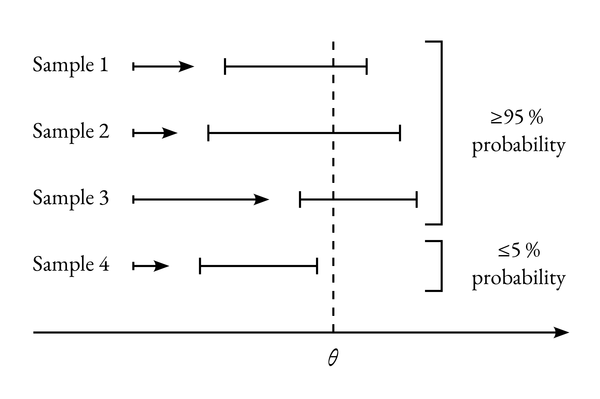

# Confidence intervals

## Definition

An $$\alpha$$-confidence interval for a parameter $$\theta$$ may be defined
concisely as <q>an interval which covers the true value of $$\theta$$ with
probability $$\geq\alpha$$</q>. However, this definition is ambiguous without
a description of the precise mechanism implied by the word probability.

The mechanism is illustrated in the diagram below, with $$\alpha = 0.95$$. The
confidence interval is really an interval-valued function, that maps a sample
$$(x_1, x_2, \ldots, x_n)$$ drawn from the population of interest, to an
interval. If another sample is drawn, the associated confidence interval is
usually different. For some samples, the interval covers the parameter
$$\theta$$, and for other samples it does not. However, the confidence interval
function is constructed in such a way that, upon repeated sampling from the
population, the associated intervals cover the parameter $$\theta$$ with
probability $$\geq \alpha$$.
<figure>

</figure>

Importantly, the coverage probability must be $$\geq \alpha$$  <em> regardless
of the value of the parameter $$\theta$$ </em>.

Of course, one way to ensure coverage $$\geq \alpha$$ is to associate a very
large interval to each sample. In the extreme, if the associated intervals
always cover all possible values of the parameter, the coverage will be 1. But
these would not be very useful intervals. The name of the game is to construct
intervals with coverage as close as possible to the level $$\alpha$$, without
going under.

In some cases, it is possible to construct confidence intervals with coverage
exactly equal to the confidence level. This is the case for the normal
population example below, but it is not always possible, and it is never
possible for distributions with discrete domain.

The minimum coverage reqirement for $$J$$ is so strong, that it often forces
$$J_\gamma$$ to yield very conservative (large) regions, just to make sure that
the constraint is satisfied in every corner of parameter space. For this reason
sometimes functions $$J$$ are used that violate the requirement in some small
regions of parameter space. This allows $$J$$ to yield less conservative
regions, at the price of having insufficient coverage if the true parameters
$$\theta$$ happen to fall in the regions of parameters space where the
requirement was waived. These kind of weaker confidence intervals are sometimes
characterized as _approximate_, and the stronger confidence intervals as
_exact_.

## Example: normal distribution

We will now describe a method for constructing confidence intervals on the mean
of a normally distributed population based on Student's $$t$$ random variable.

Let $$x = (x_1,\ldots x_n)$$ be a sample of $$n$$ independent and identically
distributed observations, drawn from a normally distributed population with
unknown mean $$\mu$$ and variance $$\sigma^2$$. From the sample we can compute
the sample mean $$\bar{x}$$ and the unbiased estimator $$s^2$$ of the
population variance:
\begin{equation}
    \bar{x} = \frac{1}{n} \sum_{i = 1}^{n} x_i \quad \mathrm{and} \quad
    s^2 = \frac{1}{n - 1} \sum_{i = 1}^{n} (x_i - \bar{x})^2\,.
\end{equation}

We combine these and the population mean $$\mu$$ to form Student's $$t$$ random
variable:
\begin{equation}
    t = \frac{\bar{x} - \mu}{s / \sqrt{n}}\,.
\end{equation}

Student's $$t$$ cannot be computed from the sample because it involves the
unknown population mean $$\mu$$, but it can be characterized theoretically, and
it turns out that **its distribution does not depend on the population mean and
variance**. It only depends on the sample size $$n$$. Intuitively, the effect of
varying the population mean is neutralized by the subtraction $$\bar{x} -
\mu$$, while the denominator $$s$$ neutralizes the effect of varying the
population variance.

Explicitly, the probability density function of $$t$$ is:
\begin{equation}
    p(t) = c_n \left(1 + \frac{t^2}{n - 1}\right)^{-\frac{n}{2}}\,.
\end{equation}
where $$c_n$$ is a normalization coefficient. The figure below displays the PDF
for a few values of $$n$$. It is symmetric about 0 and bell-shaped. For large
$$n$$ it approaches the standard normal distribution, whereas at smaller $$n$$
it has fatter tails.
<figure>

</figure>

We can leverage the remarkable property that the distribution of $$t$$ does not
depend on the population parameters to construct a confidence interval on the
population mean $$\mu$$. 

First, we pick our confidence level $$\gamma$$, for example $$\gamma = 0.9$$ or
$$\gamma = 0.95$$, and we find the critical value $$t_c(\gamma, n)$$ such that
$$|t| < t_c(\gamma, n)$$ with probability $$\gamma$$.  Graphically, this means
that the area below the PDF curve, for $$t$$ between $$-t_c(\gamma, n)$$ and
$$t_c(\gamma, n)$$ is equal to $$\gamma$$, as illustrated below. Crucially, the
critical value depends on the sample size $$n$$ and the coverage $$\gamma$$,
but not on the population parameters $$\mu$$ and $$\sigma$$.
<figure>

</figure>

For concreteness, below is a table of a few critical values. The values at $$n
\to \infty$$ are the same as would be obtained from the standard normal
distribution. Note how the critical values are substantially larger for small
sample size $$n$$.

<table style='max-width:4in'>
<thead>
<tr>
  <th> $$n$$ </th>
  <th> $$\gamma = 0.90$$ </th>
  <th> $$\gamma = 0.95$$ </th>
  <th> $$\gamma = 0.99$$ </th>
</tr>
</thead>
<tr><td >     2</td><td >6.31</td><td >12.71</td><td >63.66</td></tr>
<tr><td >     3</td><td >2.92</td><td > 4.30</td><td > 9.92</td></tr>
<tr><td >     4</td><td >2.35</td><td > 3.18</td><td > 5.84</td></tr>
<tr><td >     5</td><td >2.13</td><td > 2.78</td><td > 4.60</td></tr>
<tr><td >    10</td><td >1.83</td><td > 2.26</td><td > 3.25</td></tr>
<tr><td >&#8734;</td><td >1.64</td><td > 1.96</td><td > 2.58</td></tr>
</table>

Now we invert the definition of the variable $$t$$, to express the population
mean $$\mu$$ as a function of $$t$$ and the sample statistics $$\bar{x}$$ and
$$s$$:
\begin{equation}
\mu = \bar{x} - \frac{t\ s}{\sqrt{n}}\,.
\end{equation}
Since $$|t| < t_c(\gamma, n)$$ with probability $$\gamma$$, the interval
below covers the population mean $$\mu$$ also with probability $$\gamma$$:

\begin{equation}
J_\gamma(\bar{x}, s) = \left[
 \bar{x} - \frac{t_c(\gamma, n)\ s}{\sqrt{n}}\,,\
 \bar{x} + \frac{t_c(\gamma, n)\ s}{\sqrt{n}}
\right]\,.
\end{equation}

That is, $$J_\gamma$$ is a confidence interval for the population mean $$\mu$$
with coverage exactly equal to the confidence level $$\gamma$$.

It is worth noting that the population has two parameters, the mean $$\mu$$ and
the variance $$\sigma^2$$, but Student's confidence interval only informs our estimate of the mean, and does not give any information about the variance.

## Poisson distribution

Let $$x \in \mathbb{N}$$ be a single observation from a Poisson distribution with
mean $$\lambda$$:
\begin{equation}
    \mathrm{PMF}_{\mathrm{Poisson}}(x|\lambda) = 
    \frac{\lambda^x e^{-\lambda}}{x!}\,.
\end{equation}

Two confidence interval functions that constrain the parameter $$\lambda$$ from
below and from above are:

\begin{align}
    &J^{-}_{\gamma}(x) = \left\{\lambda\ |\
        \lambda > \lambda_{\mathrm{min}}(x, \gamma) \right\}\\
    &J^{+}_{\gamma}(x) = \left\{\lambda\ |\
        \lambda < \lambda_{\mathrm{max}}(x, \gamma) \right\},
\end{align}

where:

\begin{align}
    &\lambda_{\mathrm{min}}(x, \gamma) = \frac{1}{2}\mathrm{Quantile}_{\chi^2}
    \left(1 - \gamma, 2  x\right), \\
    &\lambda_{\mathrm{max}}(x, \gamma) = \frac{1}{2}\mathrm{Quantile}_{\chi^2}
    \left(\gamma, 2 (x + 1\right)).
\end{align}

For concreteness, the first few values of the bounds
$$\lambda_{\mathrm{min}/\mathrm{max}}$$ are shown in the table below.

<table>
<thead>
<tr>
  <th> </th>
  <th colspan="2"> $$\gamma = 0.95$$ </th>
  <th colspan="2"> $$\gamma = 0.975$$ </th>
  <th colspan="2"> $$\gamma = 0.995$$ </th>
</tr>
<tr>
  <th>$$x$$</th>
  <th>$$\lambda_{\mathrm{min}}$$</th>
  <th>$$\lambda_{\mathrm{max}}$$</th>
  <th>$$\lambda_{\mathrm{min}}$$</th>
  <th>$$\lambda_{\mathrm{max}}$$</th>
  <th>$$\lambda_{\mathrm{min}}$$</th>
  <th>$$\lambda_{\mathrm{max}}$$</th>
</tr>
</thead>
  <tr> <td> 0 </td><td>  0.000 </td><td>   2.996 </td><td>  0.000 </td><td>   3.689 </td><td>  0.000 </td><td>   5.298 </td></tr>
  <tr> <td> 1 </td><td>  0.051 </td><td>   4.744 </td><td>  0.025 </td><td>   5.572 </td><td>  0.005 </td><td>   7.430 </td></tr>
  <tr> <td> 2 </td><td>  0.355 </td><td>   6.296 </td><td>  0.242 </td><td>   7.225 </td><td>  0.103 </td><td>   9.274 </td></tr>
  <tr> <td> 3 </td><td>  0.818 </td><td>   7.754 </td><td>  0.619 </td><td>   8.767 </td><td>  0.338 </td><td>  10.977 </td></tr>
  <tr> <td> 4 </td><td>  1.366 </td><td>   9.154 </td><td>  1.090 </td><td>  10.242 </td><td>  0.672 </td><td>  12.594 </td></tr>
  <tr> <td> 5 </td><td>  1.970 </td><td>  10.513 </td><td>  1.623 </td><td>  11.668 </td><td>  1.078 </td><td>  14.150 </td></tr>
  <tr> <td> 6 </td><td>  2.613 </td><td>  11.842 </td><td>  2.202 </td><td>  13.059 </td><td>  1.537 </td><td>  15.660 </td></tr>
  <tr> <td> 7 </td><td>  3.285 </td><td>  13.148 </td><td>  2.814 </td><td>  14.423 </td><td>  2.037 </td><td>  17.134 </td></tr>
  <tr> <td> 8 </td><td>  3.981 </td><td>  14.435 </td><td>  3.454 </td><td>  15.763 </td><td>  2.571 </td><td>  18.578 </td></tr>
  <tr> <td> 9 </td><td>  4.695 </td><td>  15.705 </td><td>  4.115 </td><td>  17.085 </td><td>  3.132 </td><td>  19.998 </td></tr>
</table>

The one-sided confidence intervals $$J^{\pm}_\gamma$$ have coverage not less than
$$\gamma$$ for all values of $$\lambda$$, i.e. they are exact, although they do not
saturate the minimum coverage bound for all values of $$\lambda$$. In fact, no
choice of $$J$$ can do so. They can be combined to give an exact two sided
confidence interval with coverage $$2\gamma - 1$$:

\begin{equation}
    J_{2 \gamma - 1}(x) = \left\{
    \lambda\ |\ \lambda_{\mathrm{min}}(x, \gamma) < \lambda 
    <  \lambda_{\mathrm{max}}(x, \gamma) \right\}.
\end{equation}

The coverage of $$J^{\pm}_{\gamma}$$ and $$J_{2\gamma - 1}$$ as a function of
$$\lambda$$ is shown in the figure below. Note how the coverage changes
abruptly when the Poisson parameter $$\lambda$$ crosses one of the bounds
$$\lambda_{\mathrm{min}/\mathrm{max}}$$. However, despite these fluctuations,
the coverage of $$J_{\gamma \pm}$$ always remains above $$\gamma$$, and the
coverage of $$J_{2\gamma - 1}$$ always remains above $$2\gamma - 1$$.

<figure>

</figure>
