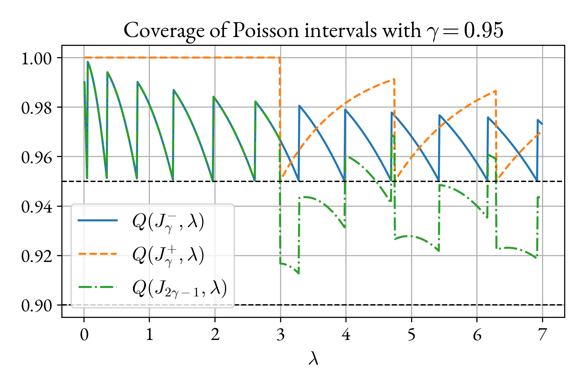

# Confidence intervals

## Definition

Let's say we have collected some observations $$x$$, for example a few die rolls:
$$x = (1, 3, 3, 6)$$. Supposedly, these observation are distributed according to
some parametric model with unknown parameters $$\theta$$. In the case of the die
roll, the model could be the categorical distribution, whose parameters are the
probabilities of each category: $$\theta = (p_1, \ldots, p_6)$$. Based on our
observations, we would like to establish some region of parameter space within
which $$\theta$$ most likely lies.

More precisely, we want to define a function $$J$$ that associates to any
possible observation $$x$$ a region $$J(x)$$ of parameter space such that
<q>most likely</q> $$\theta \in J(x)$$. To give a precise meaning to <q>most
likely</q>, we must first define the notion of _coverage_. The coverage
$$Q(J, \theta)$$ of $$J$$ given $$\theta$$ is the probability, for any given
$$\theta$$, that the interval $$J$$ covers $$\theta$$:

\begin{equation}
    Q(J, \theta) \equiv \sum_{x} p(x|\theta) I(\theta \in J(x))\,.
\end{equation}

Here $$p(x|\theta)$$ is the probability of each observation $$x$$ given $$\theta$$,
and $$I(P)$$ is the indicator function, which is 1 if the predicate $$P$$ is true,
and 0 if it is false.

A variation of $$J$$ that associates smaller regions to each observation yields a
coverage closer to 0, and conversely, a tweak towards larger regions yields a
coverage closer to 1. In the extreme, if $$J$$ yields the full parameter space
for all observations, the coverage is exactly 1. Ideally, we would like a
function $$J_\alpha$$ that gives the smallest possible regions, while preserving
at least a  prescribed minimum coverage $$\alpha \in(0, 1)$$. And crucially, we
would like $$J_\alpha$$ to do so _regardless_ of the true value of $$\theta$$:

\begin{equation}
    J_\alpha\quad |\quad \forall\, \theta \quad Q(J_\alpha, \theta) \geq \alpha
\end{equation}

This set of requirements is such a tall order that it is worth repeating: the
function $$J_\alpha$$ is expected to yield the smallest possible regions of
parameters space, while maintaning a minimum coverage, regardless of the
unknown true values of the parameters, just based on the observation $$x$$.

The region of parameter space that such a function associates to a given
observation $$x$$ is called _confidence interval_ at the confidence level
$$\alpha$$.

The minimum coverage reqirement for $$J$$ is so strong, that it often forces
$$J_\alpha$$ to yield very conservative (large) regions, just to make sure that
the constraint is satisfied in every corner of parameter space. For this reason
sometimes functions $$J$$ are used that violate the requirement in some small
regions of parameter space. This allows $$J$$ to yield less conservative
regions, at the price of having insufficient coverage if the true parameters
$$\theta$$ happen to fall in the regions of parameters space where the
requirement was waived. These kind of weaker confidence intervals are sometimes
characterized as _approximate_, and the stronger confidence intervals as
_exact_.

In some cases, depending on the parametric model, it is possible to find a
function $$J_\alpha$$ that saturates the minimum coverage bound for all values of
$$\theta$$: $$Q(J_\alpha, \theta) = \alpha\quad \forall\, \theta$$. This is the
case for observations that follow the normal distribution, but it is not always
possible, and it is never possible for distributions with discrete domain.

Since there is a lot of confusion about confidence intervals, it is also worth
emphasizing what a confidence interval is _not_:

1. The sample mean plus or minus some number times the variance of the sample
mean (unless the sample mean happens to be normally distributed).

1. A couple of quantiles of the sample mean distribution.

1. A couple of quantiles of the bayesian posterior distribution
$$p(\theta|x)$$. Intervals obtained in this way are sometimes called _credible
intervals_. They are often used in practice as a replacement for true
confidence intervals, but they have no guaratees of minimum coverage.

## Normal distribution

Let $$x = (x_1,\ldots x_n)$$ be  $$n$$ i.i.d. observations from a normal
distribution with mean $$\mu$$ and variance $$\sigma^2$$, and let $$\bar{x}$$, $$s^2$$
be the sample mean and variance:
\begin{equation}
    \bar{x} = \frac{1}{n} \sum_{i = 1}^{n} x_i \quad \mathrm{and} \quad
    s^2 = \frac{1}{n - 1} \sum_{i = 1}^{n} (x_i - \bar{x})^2\,.
\end{equation}

It can be shown that the quantity:
\begin{equation}
    t =\sqrt{n} \frac{\bar{x} - \mu}{s},
\end{equation}
follows the Student $$t$$ distribution with $$\nu = n - 1$$ degrees of freedom:
\begin{equation}
    \mathrm{PDF}_{\mathrm{Student}}(t|\nu) \propto 
    \left(1 + \frac{t^2}{\nu}\right)^{-\frac{\nu + 1}{2}}\,.
\end{equation}

Note that the distribution of the $$t$$ statistic does _not_ depend on the
parameters $$(\mu, \sigma)$$ of the normal distribution from which the sample $$x$$
is drawn, it only depends on the sample size $$n$$. This is a remarkable and
often understated fact. Based on this observation, we define a confidence
interval function

\begin{equation}
    J(x) = \left\{(\mu, \sigma)\ |\
    \bar{x} - \frac{z s}{\sqrt{n}} < \mu
    < \bar{x} + \frac{zs}{\sqrt{n}}\right\}
\end{equation}

where $$z > 0$$ is a free parameter.

The coverage of $$J$$ is:

\begin{align}
    Q(J, \mu, \sigma) 
    &= \int \dd x_1\ldots \dd x_n\, p(x_1,\ldots, x_n)\,
    I\left(\bar{x} - \frac{z s}{\sqrt{n}} < \mu 
        < \bar{x} + \frac{z s}{\sqrt{n}}\right)\\
    &= \int \dd x_1\ldots \dd x_n\, p(x_1,\ldots, x_n)\,
    I\left(-z < t < z\right)\\
    & = \int \dd t\ \mathrm{PDF}_{\mathrm{Student}}(t|n - 1) I(-z < t < z) \\
    & = \mathrm{CDF}_{\mathrm{Student}}(z|n - 1) - 
        \mathrm{CDF}_{\mathrm{Student}}(-z|n - 1)\,.
\end{align}

Thus the coverage of $$J$$ does _not_ depend on the parameters $$(\mu,
\sigma)$$ of the model, and can be set to be equal to any prescribed value
$$\alpha \in (0, 1)$$ by choosing appropriately the parameter $$z$$.

Therefore, the confidence intervals produced by $$J$$ are exact, and saturate the
minimum coverage bound for all values of $$(\mu, \sigma)$$. However, it is worth
noting that the intervals only constrain the mean parameter $$\mu$$, and do not
give any guarantees on the variance parameter $$\sigma^2$$.

## Poisson distribution

Let $$x \in \mathbb{N}$$ be a single observation from a Poisson distribution with
mean $$\lambda$$:
\begin{equation}
    \mathrm{PMF}_{\mathrm{Poisson}}(x|\lambda) = 
    \frac{\lambda^x e^{-\lambda}}{x!}\,.
\end{equation}

Two confidence interval functions that constrain the parameter $$\lambda$$ from
below and from above are:

\begin{align}
    &J^{-}_{\alpha}(x) = \left\{\lambda\ |\
        \lambda > \lambda_{\mathrm{min}}(x, \alpha) \right\}\\
    &J^{+}_{\alpha}(x) = \left\{\lambda\ |\
        \lambda < \lambda_{\mathrm{max}}(x, \alpha) \right\},
\end{align}

where:

\begin{align}
    &\lambda_{\mathrm{min}}(x, \alpha) = \frac{1}{2}\mathrm{Quantile}_{\chi^2}
    \left(1 - \alpha, 2  x\right), \\
    &\lambda_{\mathrm{max}}(x, \alpha) = \frac{1}{2}\mathrm{Quantile}_{\chi^2}
    \left(\alpha, 2 (x + 1\right)).
\end{align}

For concreteness, the first few values of the bounds
$$\lambda_{\mathrm{min}/\mathrm{max}}$$ are shown in the table below.

<table>
<thead>
<tr>
  <th> </th>
  <th colspan="2"> $$\alpha = 0.95$$ </th>
  <th colspan="2"> $$\alpha = 0.975$$ </th>
  <th colspan="2"> $$\alpha = 0.995$$ </th>
</tr>
<tr>
  <th>$$x$$</th>
  <th>$$\lambda_{\mathrm{min}}$$</th>
  <th>$$\lambda_{\mathrm{max}}$$</th>
  <th>$$\lambda_{\mathrm{min}}$$</th>
  <th>$$\lambda_{\mathrm{max}}$$</th>
  <th>$$\lambda_{\mathrm{min}}$$</th>
  <th>$$\lambda_{\mathrm{max}}$$</th>
</tr>
</thead>
  <tr> <td> 0 </td><td>  0.000 </td><td>   2.996 </td><td>  0.000 </td><td>   3.689 </td><td>  0.000 </td><td>   5.298 </td></tr>
  <tr> <td> 1 </td><td>  0.051 </td><td>   4.744 </td><td>  0.025 </td><td>   5.572 </td><td>  0.005 </td><td>   7.430 </td></tr>
  <tr> <td> 2 </td><td>  0.355 </td><td>   6.296 </td><td>  0.242 </td><td>   7.225 </td><td>  0.103 </td><td>   9.274 </td></tr>
  <tr> <td> 3 </td><td>  0.818 </td><td>   7.754 </td><td>  0.619 </td><td>   8.767 </td><td>  0.338 </td><td>  10.977 </td></tr>
  <tr> <td> 4 </td><td>  1.366 </td><td>   9.154 </td><td>  1.090 </td><td>  10.242 </td><td>  0.672 </td><td>  12.594 </td></tr>
  <tr> <td> 5 </td><td>  1.970 </td><td>  10.513 </td><td>  1.623 </td><td>  11.668 </td><td>  1.078 </td><td>  14.150 </td></tr>
  <tr> <td> 6 </td><td>  2.613 </td><td>  11.842 </td><td>  2.202 </td><td>  13.059 </td><td>  1.537 </td><td>  15.660 </td></tr>
  <tr> <td> 7 </td><td>  3.285 </td><td>  13.148 </td><td>  2.814 </td><td>  14.423 </td><td>  2.037 </td><td>  17.134 </td></tr>
  <tr> <td> 8 </td><td>  3.981 </td><td>  14.435 </td><td>  3.454 </td><td>  15.763 </td><td>  2.571 </td><td>  18.578 </td></tr>
  <tr> <td> 9 </td><td>  4.695 </td><td>  15.705 </td><td>  4.115 </td><td>  17.085 </td><td>  3.132 </td><td>  19.998 </td></tr>
</table>

The one-sided confidence intervals $$J^{\pm}_\alpha$$ have coverage not less than
$$\alpha$$ for all values of $$\lambda$$, i.e. they are exact, although they do not
saturate the minimum coverage bound for all values of $$\lambda$$. In fact, no
choice of $$J$$ can do so. They can be combined to give an exact two sided
confidence interval with coverage $$2\alpha - 1$$:

\begin{equation}
    J_{2 \alpha - 1}(x) = \left\{
    \lambda\ |\ \lambda_{\mathrm{min}}(x, \alpha) < \lambda 
    <  \lambda_{\mathrm{max}}(x, \alpha) \right\}.
\end{equation}

The coverage of $$J^{\pm}_{\alpha}$$ and $$J_{2\alpha - 1}$$ as a function of
$$\lambda$$ is shown in the figure below. Note how the coverage changes
abruptly when the Poisson parameter $$\lambda$$ crosses one of the bounds
$$\lambda_{\mathrm{min}/\mathrm{max}}$$. However, despite these fluctuations,
the coverage of $$J_{\alpha \pm}$$ always remains above $$\alpha$$, and the
coverage of $$J_{2\alpha - 1}$$ always remains above $$2\alpha - 1$$.

<figure>

</figure>
