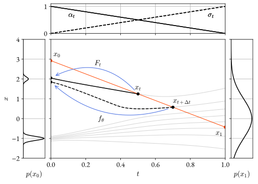

# Consistency models

## Goal
Consistency models [[1]][ref_1][[3]][ref_3] is a technique for training few-step generative
models without distillation.

The goal is to regress a deterministic model $$f$$ with parameters $$\theta$$
that maps a normally distributed random variable $$x_1$$ to a variable $$x_0$$
distributed like the data:
\begin{equation}
x_1 \sim \normal{0}{I}\,,\quad  x_0 = f_\theta(x_1) \sim \mathrm{Data}\,.
\end{equation}
The PDF of the data distribution is not required, only the ability to sample
from it. For example, the data distribution may be that of images from ImageNet.

## Stochastic interpolant

The technique leverages a stochastic interpolant [[2]][ref_2] $$x_t$$, whose
marginal distribution interpolates between the data distribution and the noise
distribution:
\begin{equation}
x_t|x_0, x_1 = \alpha_t x_0 + \sigma_t x_1\,,\quad t \in [0, 1]\,,
\end{equation}
where $$\alpha$$ and $$\sigma$$ are interpolating functions such that
$$\alpha_0 = \sigma_1 = 1$$, $$\alpha_1 = \sigma_0 = 0$$.  A simple
one-dimensional interpolant $$x_t$$ is illustrated in the figure below.

<figure>

</figure>

Incidentally, the marginal distribution of $$x_t$$ matches the marginal
distribution of a certain diffusion process associated with $$\alpha$$ and
$$\sigma$$. This relationship is described
[here](/pages/diffusion#section-forward-process), but is not relevant for
consistency models. 

## Probability flow

It is possible to construct a deterministic function $$h: (t, x_0) \mapsto
h_t(x_0)$$ that maps the data random variable $$x_0$$ to the interpolant random
variable
$$x_t$$:
\begin{equation}
x_0 \sim \mathrm{Data}\quad \Leftrightarrow\quad h_t(x_0) \sim x_t.
\end{equation}
For any fixed $$t$$, the map is invertible, and its inverse maps samples from
$$x_t$$ to samples from the data distribution. In particular, the inverse of
$$h_1$$ is a generative function that maps pure noise to the data distribution.

The diagram in the previous section displays in white the trajectories of a few
points under $$h$$.

The function $$h$$ satisfies the <i>probability flow</i> ODE. This fact is
illustrated in greater detail on the [diffusion
page](/pages/diffusion#section-probability-flow). When $$\alpha$$ and $$\sigma$$
are linear, it has a particularly simple form:
\begin{equation}
    \frac{\dd h_t}{\dd t} = \expectation{x_0, x_1 | x_t = h_t}{x_1 - x_0}\,,
\end{equation}
where the distribution $$x_0, x_1 | x_t$$ is obtained by applying Bayes' rule
no the definition of the interpolant $$x_t$$.  For simplicity, in the following
we will assume linear $$\alpha$$ and $$\sigma$$, but all the arguments can be
generalized to the non-linear case.

Geometrically, the tangent to a flow trajectory at a point $$x_t$$ is the
average slope of all the lines connecting $$x_0\sim\mathrm{Data}$$ and
$$x_1\sim\normal{0}{I}$$ that pass through $$x_t$$. This is illustrated in the
figure below.
<figure>

</figure>

## Few-steps sampling

Given a model $$f_\theta$$ capable of inverting the probability flow map $$h$$
for any time $$t$$:

\begin{equation}
f_\theta(t, x_t) \simeq h^{-1}_t(x_t)\,,
\end{equation}

it is possible to to generate samples from the data distribution in a single
step:
\begin{equation}
x_1 \sim \normal{0}{1}\quad \Rightarrow\quad f_\theta(1, x_1) \sim \mathrm{Data}\,.
\end{equation}

However, the quality of the output can be further improved, at greater
computational cost, by repeatedly applying the model and adding noise along a
decreasing sequence of interpolation times $$(1, t_1, \ldots, t_n, 0)$$:

\begin{equation}
\begin{aligned}
&x_{t_1} = \alpha_{t_1}f_\theta(1, z_0) + \sigma_{t_1} z_1 \\
&x_{t_2} = \alpha_{t_2}f_\theta(t_1, z_1) + \sigma_{t_2} z_2 \\
&\ldots\\
&x_{0} = f_\theta(t_n, z_n)\,,
\end{aligned}
\end{equation}

where $$z_i$$ are <i>i.i.d.</i> standard normal random variables. If the model
approximates well the probability flow map, each intermediate variable $$x_t$$
is distributed like the stochastic interpolant at the corresponding time, and
therefore a valid input for the next model invocation.

## Inductive learning

The training of consistency models uses a loose form of mathematical induction:
assume that a solution exists for interpolation time $$t$$, and use it to
construct a solution for time $$t + \Delta t$$. 

We first describe a simplified form of the algorithm with reference to the
diagram below, where  $$x_0 \sim \mathrm{Data}$$ and $$x_1 \sim
\normal{0}{I}$$. When $$\alpha$$ and $$\sigma$$ are linear, the interpolant
$$x_t|x_0, x_1$$ lies on the line from $$x_0$$ to $$x_1$$.

<figure>
 
</figure>

Assume that a <i>target network</i> $$F_t$$ has been obtained that can predict
the starting point of any flow trajectory given its value $$x_t$$ at some fixed
time $$t$$. If we can construct a point <i>on the same trajectory</i> at later
time $$t + \Delta t$$, we can use the output of the target network as a
regression target for an <i>online network</i>  $$f_\theta$$ that predicts
the starting point given $$x_{t + \Delta t}$$.

The two points $$x_t$$ and $$x_{t + \Delta t}$$ can be constructed to lie on
the same trajectory in two ways:

1. If the two points $$x_t$$ and $$x_{t + \Delta t}$$ are chosen to lie on the
   same line from $$x_0$$ to $$x_1$$, they are not on the same trajectory, but
they are <i>almost</i> on the same trajectory. More precisely, in expectation,
the difference between the starting points $$h^{-1}(x_t)$$ and $$h^{-1}(x_{t +
\Delta t})$$ is of order $$\Delta t^2$$
([proof](#section-proof-error-magnitude)). This is because, in expectation, the
line is tangent to the flow trajectory, and fluctuations cancel out at first
order. This approach is dubbed training <i>in isolation</i>.

2. Alternatively, a separate model can be trained to predict the tangent to the
   trajectory. The training objective for this model is essentially [denoising
score matching](/pages/diffusion#section-denoising-score-matching), and
consistency models paired with this approach can be seen as distilling a
standard diffusion model into a more efficient few-step sampler. The error
involved in this approach is the difference between the tangent and the
trajectory, which is also of order $$\Delta t^2$$

In both cases, since the solution at $$t = 1$$ is obtained by repeating
induction $$1 / \Delta t$$ times, the final error is of order $$\Delta t$$, and
can be made arbitrarily small.

The base case of the induction sequence is that at $$t = 0$$, the target
network is the identity: $$F_0(x_0) = x_0$$.

In practice, all the induction steps are trained simultaneously, with a single
model $$f_\theta(t, x_t)$$ serving as online network, and an exponential moving
average $$f_{\theta^{-}}$$ of the same serving as target network.

Explicitly, when training in isolation, the loss is:
\begin{equation} L(\theta) = \expectation{t, x_0, x_1}{\norm{f_{\theta}(t +
\Delta t, x_t + (x_1 - x_0) \Delta t) - f_{\theta^{-}}(t, x_t)}^2}\,.
\end{equation}

The boundary condition $$f_\theta(0, x_0) = x_0$$ is enforced explicitly in the
parametrization of the model, and is essential to avoid representation
collapse.

## Proofs

### Isolation loss error magnitude {#section-proof-error-magnitude}

The loss for a single induction step is:

 
\begin{equation} 
L[f] = \expectation{x_0, x_1}{\norm{f(x_t) - F\left(x_t - (x_1 - x_0)\, \Delta t\right)}^2}\,.
\end{equation} 

The unconstrained optimum of this loss is
([proof](/pages/diffusion#section-proof-unconstrained-optimum)):
\begin{equation}
f_{\mathrm{opt}}(x_t) = \expectation{x_0, x_1|x_t}{F\left(x_t - (x_1 - x_0)\,\Delta t\right)}\,.
\end{equation}

If the function $$F$$ is twice differentiable, we can expand it in Taylor
series about $$x_t - \expectation{}{x_1 - x_0}\,\Delta t$$, to obtain:
\begin{equation}
f_{\mathrm{opt}}(x_t) = F\left(x_t - \expectation{x_0, x_1|x_t}{x_1 - x_0}\,\Delta t\right) + O(\Delta t^2)\,.
\end{equation}

If $$x_{t - \Delta t}$$ is on the same probability flow trajectory as $$x_t$$,
the ODE implies:
\begin{equation}
x_{t - \Delta t} = x_t - \expectation{x_0, x_1|x_t}{x_1 - x_0}\,\Delta t + O(\Delta t^2)\,..
\end{equation}
and, again by Taylor expansion:
\begin{equation}
f_{\mathrm{opt}}(x_t) = F\left(x_{t - \Delta t}\right) + O(\Delta t^2)\,.
\end{equation}

See the paper for the proof in the general case of simultaneous optimization of
all inductions steps.


