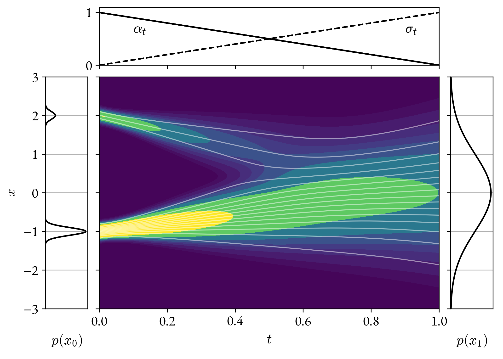
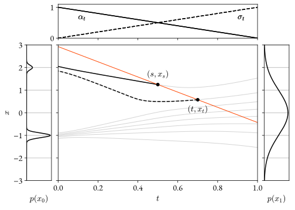

# Consistency models

Consistency models [[1]][ref_1] is a technique for training few-step generative
models without distillation.

The goal is to regress a deterministic function $$f_\theta$$ that maps a
normally distributed random variable $$x_1$$ to a variable $$x_0$$ that follows
a prescribed target distribution, to some approximation:
\begin{equation}
x_1 \sim \normal{0}{I}\,,\quad  x_0 = f_\theta(x_1) \sim \mathrm{Data}\,.
\end{equation}
The PDF of the target distribution is not required, only the ability to sample
from it. For example, the target distribution may be that of images from ImageNet.

The technique leverages a stochastic interpolant [[2]][ref_2]  $$x_t$$ that
bridges between the target distribution and the noise distribution:
\begin{equation}
x_t|x_0, x_1 = \alpha_t x_0 + \sigma_t x_1\,,\quad t \in [0, 1]\,,
\end{equation}
where $$\alpha$$ and $$\sigma$$ are interpolating functions such that:

\begin{equation}
\begin{aligned}
&\alpha_0 = 1 && \alpha_1 = 0 \\
&\sigma_0 = 0 && \sigma_1 = 1\,.
\end{aligned}
\end{equation}

For example $$\alpha_t = 1 - t$$, $$\sigma_t = t$$.

The marginal distribution of $$x_t$$ interpolates between the target
distribution and the noise distribution. This is illustrated in the figure below
for a simple one-dimensional random variable $$x_t$$.
<figure>

</figure>

Incidentally, the marginal distribution of $$x_t$$ matches the marginal
distribution of a certain diffusion process associated with $$\alpha$$ and
$$\sigma$$, but this fact is not relevant for consistency models. For more
information see the [diffusion page](/pages/diffusion).

<figure>

</figure>


