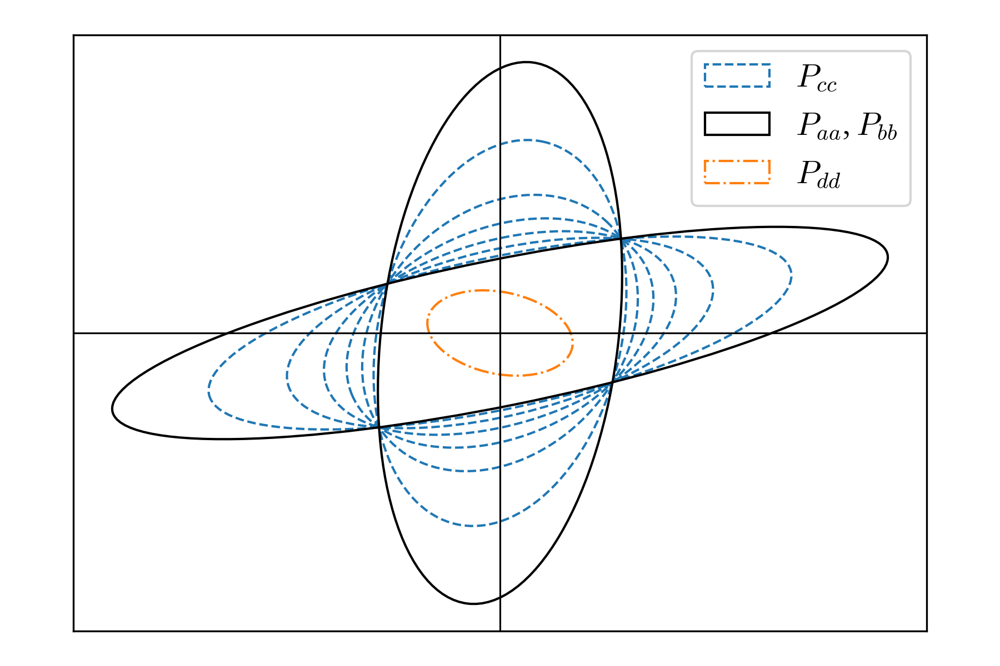

# Covariance intersection algorithm

## The algorithm

The covariance intersection algorithm [[1]][ref_1][[2]][ref_2] allows to fuse
two observations of the same parameter and establish an upper bound on the
uncertainty on the combined estimate, even if the two observations are not
independent.

The algorithm is best understood from a frequentist point of view. There is an
unknown parameter vector $$x$$, for which two different estimators $$a$$ and $$b$$
are available. Both are random variables, meaning that their respective
observation can be repeated at least in principle, and each repetition would
yield a different value. 

The algorithm assumes that the estimators $$a$$ and $$b$$ are unbiased:
\begin{equation}
E[a] = E[b] = x\,,
\end{equation}
and that an upper bound on their respective covariance is
available :
\begin{equation}
\cov {a}{ a^\transp} \le P_{aa}\,,\quad
\cov {b}{ b^\transp} \le P_{bb}\,,
\end{equation}
where $$A \le B$$ means that $$B - A$$ is positive semi-definite.

However, estimators $$a$$ and $$b$$ need not be independent, and the
cross-covariance is unknown.

The algorithm combines the estimators $$a$$ and $$b$$ to construct a family of
estimators $$c(\omega)$$ parametrized by $$\omega \in [0, 1]$$.  Each estimator
$$c(\omega)$$ is unbiased, and the algorithm also produces an upper bound
$$P_{cc}(\omega)$$ on its covariance:
\begin{equation}
    E[c(\omega)] = x\,,\quad
    \cov{c(\omega)}{ c^\transp(\omega)} \le P_{cc}(\omega)\,.
\end{equation}

Importantly, the bound $$P_{cc}$$ holds regardless of the value of the
cross-covariance $$\cov{a}{b^\transp}$$, which is unknown.

An optimal value of $$\omega$$ may be chosen according to a preferred metric,
such as minimizing the trace or the determinant of $$P_{cc}$$. Since the familiy
of estimators $$c(\omega)$$ includes $$a$$ and $$b$$, the optimal $$c(\omega)$$ is at
least as good as the best of $$a$$ and $$b$$.

The estimator $$c$$ and the upper bound $$P_{cc}$$ are given by:
\begin{equation}
P_{cc}(\omega)^{-1} =\omega P_{aa}^{-1} + (1 - \omega) P_{bb}^{-1}
\end{equation}
\begin{equation}
P_{cc}(\omega)^{-1}c(\omega) = \omega P_{aa}^{-1}a + (1 - \omega) P_{bb}^{-1}b
\end{equation}

## A better estimator when the cross-covariance is known

If the covariance of the combined vector $$(a, b)$$ is bounded:

\begin{equation}
\cov{\begin{pmatrix}a \\ b\end{pmatrix}}
    {\begin{pmatrix}a^\transp & b^{\transp}\end{pmatrix}} 
\le P = 
\begin{pmatrix}
    P_{aa} & P_{a b} \\
    P_{ab}^\transp & P_{b b} \\
\end{pmatrix}
\,,
\end{equation}

then it is possible to construct an unbiased estimator $$d$$ with a tighter bound
than any of the estimators $$c(\omega)$$ produced by the covariance intersection
algorithm:
\begin{equation}
    E[d] = x\,,\quad
    \cov{d}{ d} \le P_{dd}\,.
\end{equation}

The estimator $$d$$ and the upper bound $$P_{dd}$$ are given by:
\begin{equation}
P_{dd}^{-1} =H^\transp P^{-1} H
\end{equation}

\begin{equation}
P_{dd}^{-1}d = H^\transp P^{-1} \begin{pmatrix}a \\ b\end{pmatrix}\,,
\end{equation}

where $$H$$ is the matrix:

\begin{equation}
H = \begin{pmatrix}I \\ I \end{pmatrix}\,.
\end{equation}

It can be shown that:
\begin{equation}
  P_{dd} \le P_{aa},\ P_{dd} \le P_{bb}\,,
\end{equation}
and consequently:
\begin{equation}
    P_{dd}\le P_{cc}(\omega)\quad \forall\ \omega \in [0, 1]\,.
\end{equation}

More in general, it is possible to establish an upper bound on the covariance
of any unbiased estimator that depends linearly on $$a$$ and $$b$$. Among all
these estimators, $$d$$ has the upper bound  $$P_{dd}$$ with the smallest
trace.

## Geometric interpretation

It is helpful to visualize the covariance upper bounds in terms of their
covariance ellipsoid. To any symmetric positive definite matrix $$P\in
\mathbb{R}^{n,n}$$ we can associate a subset of $$\mathbb{R}^n$$ in the shape
of an ellipsoid:

\begin{equation}
    B(P) = \{x\in\mathbb{R}^n\ /\ x^\transp P^{-1} x \le 1\}\,,
\end{equation}

and  $$B(P_1)$$ is included in $$B(P_2)$$ if and only if $$P_1 \le P_2$$:
\begin{equation}
    P_1 \le P_2\ \Leftrightarrow\ B(P_1) \subseteq B(P_2)\,.
\end{equation}

<figure>

</figure>

The figure above uses this fact to illustrate the covariance bounds in a
two-dimensional synthetic example. In solid black, the covariance ellipse for
estimators $$a$$ and $$b$$. In dashed blue the covariance ellipses for
estimators $$c(\omega)$$ for 6 equally spaced values of $$\omega$$ between 0
and 1. In dash-dot orange the covariance ellipse for estimator $$d$$.

The ellipse $$B(P_{dd})$$ is always included in both $$B(P_{aa})$$ and
$$B(P_{bb})$$, <i>i.e.</i> it lies entirely within their intersection. The
ellipses $$B(P_{cc}(\omega))$$ smoothly interpolate between $$B(P_{aa})$$ and
$$B(P_{bb})$$. Moreover, $$B(P_{cc}(\omega))$$ always contains the entire
intersection of $$B(P_{aa})$$ and $$B(P_{bb})$$. This property gives the name
to the algorithm.

## Proofs
### $$c$$ is unbiased

\begin{align}
P_{cc}^{-1}E[c] &= \omega P_{aa}^{-1}E[a] + (1 - \omega) P_{bb}^{-1}E[b] \\
                &= \omega P_{aa}^{-1}x + (1 - \omega) P_{bb}^{-1}x \\
                &= P_{cc}^{-1}x
\end{align}

### $$P_{cc}$$ bounds the covariance of $$c$$

Multiplying the thesis $$\cov{c}{ c^\transp} \leq P_{cc}$$ left and right by
$$P_{cc}^{-1}$$ we have:
\begin{align}
    \Delta \equiv P_{cc}^{-1} - \cov{P_{cc}^{-1} c}{ c^{\transp} P_{cc}^{-1}} \geq 0\,.
\end{align}

Using the definition of $$c$$:

\begin{align}
\Delta =\
&P_{cc}^{-1} - \omega^2P_{aa}^{-1}\cov{a}{ a^\transp} P_{aa}^{-1} \\
&- (1-\omega)^2P_{bb}^{-1}\cov{b}{ b^\transp} P_{bb}^{-1} \\
&- \omega(1-\omega)P_{bb}^{-1}\cov{b}{ a^\transp} P_{aa}^{-1}\\
&- \omega(1-\omega)P_{aa}^{-1}\cov{a}{ b^\transp} P_{bb}^{-1}\,.
\end{align}

Using the bounds on the covariance of $$a$$ and $$b$$:

\begin{align}
\Delta \ge\
&P_{cc}^{-1} - \omega^2P_{aa}^{-1} - (1-\omega)^2P_{bb}^{-1} \\
&- \omega(1-\omega)P_{bb}^{-1}\cov{b}{ a^\transp} P_{aa}^{-1}\\
&- \omega(1-\omega)P_{aa}^{-1}\cov{a}{ b^\transp} P_{bb}^{-1}\,.
\end{align}

Substituting the explicit expression for $$P_{cc}$$ and collecting similar terms:

\begin{align}
\Delta \ge\ \omega(1-\omega) \Big[&
    P_{aa}^{-1}P_{aa}P_{aa}^{-1} + P_{bb}^{-1}P_{bb}P_{bb}^{-1} \\
&- P_{bb}^{-1}\cov{b}{ a^\transp} P_{aa}^{-1}- P_{aa}^{-1}\cov{a}{ b^\transp} P_{bb}^{-1} \Big]\,.
\end{align}

Using the bounds on the covariance of $$a$$ and $$b$$ a second time:

\begin{align}
\Delta \ge\ \omega(1-\omega) \Big[&
    P_{aa}^{-1}\cov{a}{ a^\transp}P_{aa}^{-1} + P_{bb}^{-1}\cov{b}{ b^\transp} P_{bb}^{-1} \\
&- P_{bb}^{-1}\cov{b}{ a^\transp} P_{aa}^{-1}- P_{aa}^{-1}\cov{a}{ b^\transp} P_{bb}^{-1} \Big]\,,
\end{align}

and finally:
\begin{align}
\Delta \ge\ \omega(1-\omega)\ \cov{
P_{aa}^{-1}a - P_{bb}^{-1}b}{ a^\transp P_{aa}^{-1} - b^\transp P_{bb}^{-1}} \geq 0\,.
\end{align}

### $$d$$ is unbiased

\begin{align}
    P_{dd}^{-1}E[d] &= H^\transp P^{-1} \begin{pmatrix}E[a]\\E[b]\end{pmatrix}
    =H^\transp P^{-1} \begin{pmatrix}x\\x\end{pmatrix}
    =H^\transp P^{-1} H x  = P_{dd}^{-1} x 
\end{align}

### $$P_{dd}$$ bounds the covariance of $$d$$

\begin{align}
    P_{dd}^{-1} \cov{d}{ d^{\transp}} P_{dd}^{-1} & =
    H^{\transp} P^{-1} \cov{\begin{pmatrix}a\\b\end{pmatrix}}{ 
    \begin{pmatrix}a^\transp & b^\transp\end{pmatrix}}P^{-1}H \\
    &\le H^{\transp} P^{-1} PP^{-1}H = P_{dd}^{-1} P_{dd} P_{dd}^{-1}\,.
\end{align}

### $$P_{dd}\le P_{aa},\ P_{bb},\ P_{cc}(\omega)$$

The thesis $$P_{dd} \leq P_{aa}$$ is equivalent to $$P_{dd}^{-1} \geq
P_{aa}^{-1}$$. This is not entirely trivial, but not too hard to prove.

We parametrize the inverse of $$P$$ as:

\begin{equation}
    P^{-1}=\begin{pmatrix}A_{aa}& A_{ab}\\ A_{ab}^\transp & A_{bb} \end{pmatrix}\,,
\end{equation}

and use the block form of matrix inverse to express $$P_{aa}$$ in terms of this
parametrization:
\begin{equation}
    P_{aa}^{-1} = A_{aa} - A_{ab} A_{bb}^{-1} A_{ab}^\transp\,.
\end{equation}

Thus we have:

\begin{align}
    P_{dd}^{-1} - P_{aa}^{-1} &= H^\transp P^{-1} H - P_{aa}^{-1} \\
    &= A_{ab} + A_{ab}^\transp + A_{bb} + A_{ab}A_{bb}^{-1}A_{ab}^\transp\\
    &=(A_{ab} + A_{bb})A_{bb}^{-1}(A_{ab} + A_{bb})^\transp \geq 0\,.
\end{align}

Similarly we can prove $$P_{dd} \leq P_{bb}$$, and consequently $$P_{dd} \leq
P_{cc}(\omega)$$, since $$P_{cc}^{-1}(\omega)$$ is a convex combination of
$$P_{aa}^{-1}$$ and $$P_{bb}^{-1}$$.

### $$d$$ is optimal
We consider the family of estimators:

\begin{equation}
d(K) = K^\transp\begin{pmatrix}a\\b\end{pmatrix}\,,
\end{equation}

parametrized by the matrix $$K$$.

The covariance of $$d(K)$$ has the upper bound:
\begin{equation}
    \cov{d(K)}{ d(K)^\transp} \le K^\transp P K\,,
\end{equation}
and $$d(K)$$ is unbiased if and only if the matrix $$K$$ satisfies the constraint:
\begin{equation}
    K^\transp H = I\,.
\end{equation} 

We want to find the matrix $$K$$ that minimizes the trace of the upper bound
subject to this constraint, which we enforce using a matrix of Lagrange
multipliers $$\Lambda$$:
\begin{equation}
    \delta_K\ \trace{KPK^\transp - 2\Lambda^\transp(K^\transp H - I)} = 0\,.
\end{equation}

The saddle point equation is:
\begin{equation}
    KP - \Lambda H^\transp = 0\,,
\end{equation}
which, together with the constraint equation yields:

\begin{align}
    &\Lambda = (H^\transp P^{-1} H)^{-1} \\
    &K = (H^\transp P^{-1} H)^{-1}H^\transp P^{-1}\,.
\end{align}

### $$B(P_{cc})$$ contains the intersection of $$B(P_{aa})$$ and $$B(P_{bb})$$

\begin{align}
    x \in B(P_{aa}) \cap B(P_{bb})\ &\Rightarrow\ x^\transp P_{aa}^{-1}x \leq 1\ \land\ x^\transp P_{bb}^{-1}x \leq 1\\
    &\Rightarrow \omega x^\transp P_{aa}^{-1}x + (1-\omega) x^\transp P_{bb}^{-1}x \leq 1\\
    &\Rightarrow x^\transp P_{cc}^{-1}(\omega)x\leq 1\\
    &\Rightarrow x \in B(P_{cc}(\omega))
\end{align}


