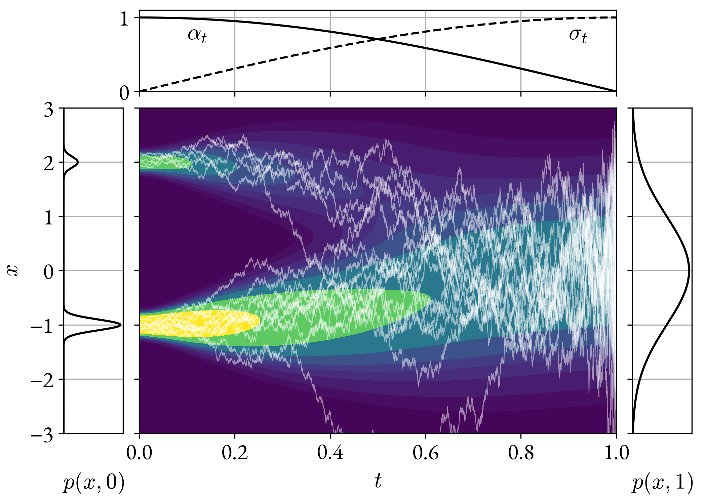
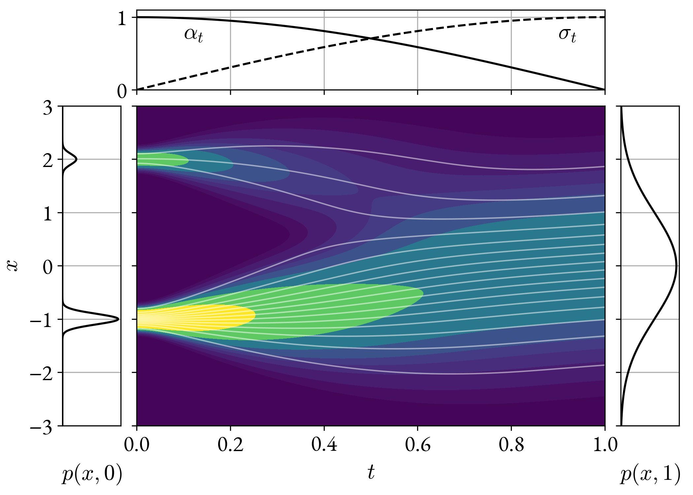

# Data from noise

## Diffusion

The goal of generative modeling is to map a random variable with a known and
simple distribution (<i>e.g.</i> the normal distribution), to a random
variable distributed like the data:
\begin{equation}
    x \sim \normal{0}{I}\,; \quad y = f(x) \sim \mathrm{Data}\,.
\end{equation}

The function $$f$$ is to be learned from a sample from the data distribution.  At
this level it is not at all clear how a learning objective may be specifed for
$$f$$. One approach is learning to reverse a diffusion process in which small
amounts of noise are progressively added to the data variable $$y$$ until it
becomes essentially pure noise.

The diffusion process is described at a high level by the graphical model:

<figure markdown=1>
{:style="max-width:4.58in"}
</figure>

and in detail by the recurrence relation:
\begin{equation}
    x_{t + \Delta t} = x_{t} - \frac{1}{2} g^2(t) \Delta t\, x_t + g(t) \sqrt{\Delta t}\, z_{t}\,,
\end{equation}
where:

1.  $$\{x_t\}$$ is a set of random variables, one for each value of $$t$$. The
    first one, $$x_0$$, is distributed like the data, and the following are
    progressively noisier.

1.  $$z_t \sim \normal{0}{I}$$ is the noise variable that is added at each step.
    $$z_t$$ is independent from $$z_s$$ for all $$t \neq s$$, and is also independent
    from $$x_s$$ for $$s \leq t$$.

1.  $$g$$ is a function parameter, sometimes called noise schedule, that
    controls the amount of noise that is injected at every step of the
    diffusion process

1.  $$\Delta t$$ is a discretization step. In the limit $$\Delta t \to 0$$ the
    recurrence relation becomes a stochastic differential equation. Results
    below are given in this limit.

Many properties of the diffusion process depend on the noise schedule $$g$$ only
through the positive, monotonically decreasing function:
\begin{equation}
    \Lambda(t) = \ee^{-\frac{1}{2} \int_0^{t} g^2(s)\, \dd s}\,.
\end{equation}
In particular, $$\Lambda(t) \to 0$$ for $$t \to \infty$$ (unless $$g$$ goes to zero
faster than $$1/t$$).

Here are some of those properties that are relevant for inverting the process:

1.  $$\expectation{}{x_t} = \Lambda(t) \expectation{}{x_0}$$, and in particular
    $$\expectation{}{x_t}\to 0$$ for $$t \to \infty$$.

1.  $$\cov{x_t}{x_t^{\transp}} = I + \Lambda^2(t) (\cov{x_0}{x_0^\transp} - I)$$, 
    and in particular $$\cov{x_t}{x_t^{\transp}} = I$$ for $$t \to \infty$$.

1.  The joint distribution of any set of variables $$(x_{t_1}, x_{t_2},
    \ldots)$$ *conditional* on  $$x_0$$ is normal. This is because the
    recurrence relation is linear in the random variables.

1.  In particular, $$x_t|x_0 \sim \normal{\Lambda(t) x_0}{(1 -
    \Lambda^2(t)) I}$$. This makes it efficient to sample $$x_t$$ both
    conditionally on $$x_0$$ and unconditionally, without using ancestral
    sampling through the recurrence relation.

1.  $$x_t \sim \normal{0}{I}$$ for $$t \to \infty$$. Thus $$x_t$$ for large $$t$$
    is the noise variable from which we want to learn to generate $$x_0$$.

Below is an illustrative one-dimensional example of the diffusion process. On
the left is the <q>data</q> distribution, which we take to be a mixture of two
narrow normal distributions. On the right is the final distribution
$$\normal{0}{I}$$. In the middle is a contour plot of the PDF of $$x_t$$, and
overlayed as white lines are 16 samples from the process. For this example
$$g(t) = 1$$.

<figure markdown=1>
{:style="max-width:7in"}
</figure>

## Reverse diffusion

Remarkably, the joint distribution of $$x_t$$ specified by the diffusion process
can also be obtained in reverse, <i>i.e.</i> according to the graphical
model:
<figure markdown=1>
{:style="max-width:4.58in"}
</figure>
through the recurrence relation:
\begin{equation}
    x_{t - \Delta t} = x_t + g^2(t) \Delta t \left[\frac{x_t}{2} + 
    \nabla \log p(x_t, t) \right] + g(t) \sqrt{\Delta t}\, \bar{z}_t
\end{equation}
where:

1.  $$x_t \sim \normal{0}{I}$$ for $$t \to \infty$$

1.  $$\bar{z}_t \sim \normal{0}{I}$$. $$\bar{z}_t$$ is independent from
    $$\bar{z}_s$$ for all $$t \neq s$$, and also from $$x_s$$ for $$s \geq t$$.

1.  $$p(x,t)$$ is the marginal PDF of $$x_t$$, <i>i.e.</i>
    $$\mathrm{Pr}[x_t\in D] = \int_D p(x, t) \dd x$$ for any domain
    $$D$$. 

The joint distribution of $$x_t$$ generated by this recurrence relation is the
same as the one generated by the forward diffusion process. In particular,
$$x_0 \sim \mathrm{Data}$$, and the figure in the previous section is also an
entirely valid illustration of this reverse process.

The recurrence relation is not linear. This is necessary to generate a
non-normal distribution for $$x_0$$ from normally distributed $$x_\infty$$ and
$$z_t$$. Therefore, unlike the forward process, there is no way to sample the
process more efficiently than by using the recurrence relation.

<figure markdown=1>
{:style="max-width:5in"}
</figure>

The relation depends on the so-called <q>score function</q> $$\nabla \log p(x, t)$$.
This is a vector field that points everywhere towards regions of high
probability, and drives the reverse diffusion process there.  The practical use
of reverse diffusion to sample from the data distribution depends on the
ability to evaluate the score function efficiently.

## Score matching -- denoising autoencoder

An efficient objective can be specified to learn a parametric approximation
$$s_\theta(x, t)$$ to the score function $$\nabla \log p(x, t)$$. The objective is
the naive one:
\begin{equation}
    L(\theta, t) = \expectation{x_t}{\left|s_{\theta}(x_t, t) - \nabla \log p(x_t, t)\right|^2}\,,
\end{equation}
but made tractable thanks to the non-trivial equivalence:
\begin{equation}
    L(\theta, t) = \expectation{x_0, x_t}{\left|s_{\theta}(x_t, t) - \nabla \log p(x_t | x_0, t)\right|^2}\,,
\end{equation}
where $$p(x_t|x_0, t)$$ is the PDF of $$x_t$$ *conditional* on $$x_0$$.

The second form is tractable because, as discussed before:
\begin{equation}
    x_t|x_0 \sim \normal{\Lambda(t) x_0}{(1 - \Lambda^2(t)) I}
\end{equation}
and hence:
\begin{equation}
    L(\theta, t) = \expectation{x_0, x_t}{\left|s_{\theta}(x_t, t) - 
    \frac{\Lambda(t)x_0 - x_t}{1 - \Lambda^2(t)}\right|^2}\,.
\end{equation}

The learning objective can be interpreted as the objective for a denoising
autoencoder:

1.  Sample $$x_0$$ from the data distribution.

1.  Mix it with Gaussian noise $$z$$ to obtain $$x_t = \Lambda\, x_0 +
    \sqrt{1 - \Lambda^2}\, z$$.

1.  Regress the added noise $$z / \sqrt{1 - \Lambda^2}$$ from the noisy
    variable $$x_t$$ to obtain $$s_\theta(x, t)$$.

## Probability flow

It is also possible to construct an ordinary differential equation that
reproduces the marginal distribution of $$x_t$$ according to the diffusion
process, but not the joint distribution of multiple variables $$(x_{t_0},
x_{t_1}, ...)$$:
\begin{equation}
    \frac{\dd x_t}{\dd t} = - \frac{1}{2} g^2(t) \left[x_t + \nabla \log p(x_t, t) \right]\,.
\end{equation}

This ODE is known as the <q>probability flow</q> ODE, and it yields a
deterministic, invertible map between $$x_\infty \sim \normal{0}{I}$$ and $$x_0
\sim \mathrm{Data}$$.  The trajectories generated by this ODE are illustrated in
the figure below:

<figure markdown=1>
{:style="max-width:7in"}
</figure>

## Flow matching

A diffusion process is not the only way to smoothly interpolate between the
data distribution and a normal distribution. Another, arguably simpler option
is:
\begin{equation}
    x_t = \Lambda(t)\, x_0 + \sigma(t)\, z\,,
\end{equation}
where:

1.  \$$x_0 \sim \mathrm{Data}$$

1.  \$$z \sim \normal{0}{I}$$

1.  $$\Lambda$$ and $$\sigma$$ is any pair of functions such that $$\Lambda(0)
    = 1$$, $$\sigma(0) = 0$$ (for self-consistency $$x_0 = x_0$$), and
    $$\Lambda(1) = 0$$, $$\sigma(1) = 1$$, so that $$x_1 \sim \normal{0}{I}$$.
    For example $$\Lambda(t) = 1 - t$$ and $$\sigma(t) = t$$.

The marginal distribution of $$x_t$$ according to  the diffusion process can also
be cast in this form, by a special choice of $$\Lambda$$ and $$\sigma$$:
\begin{equation}
    \Lambda(t) = \ee^{-\frac{1}{2} \int_0^{t} g^2(s)\, \dd s}\quad \mathrm{and}\quad \sigma(t) = 1 - \Lambda^2(t)\,,
\end{equation}
although in this case normality is attained for $$t \to \infty$$ rather than $$t = 1$$.

A probability flow ODE can be constructed for this process:
\begin{equation}
    \frac{\dd x_t}{\dd t} = u(x_t, t),
\end{equation}
where the vector field $$u$$ is given by:
\begin{equation}
    u(x_t, t) = \frac{1}{p(x_t, t)} \expectation{x_t}{u(x_t | x_0, t)\, p(x_t|x_0, t)}\,,
\end{equation}
and:
\begin{equation}
    u(x_t|x_0, t) = \dot{\Lambda}(t) x_0 + \frac{\dot{\sigma}(t)}{\sigma(t)} (x_t - \Lambda(t) x_0)\,.
\end{equation}

The ODE is tractable only if there is an efficient parametric approximation
$$v_\theta(x, t)$$ to the vector field $$u(x, t)$$. Such an approximation can be
learned in a similar way to score matching; an approach called <q>flow
matching</q>:

$$
\begin{align}
    L(\theta, t) &= \expectation{x_t}{\left|v_\theta(x_t, t) - u(x_t, t)\right|^2} \\
    & = \expectation{x_0, x_t}{\left|v_\theta(x_t, t) - u(x_t|x_0, t)\right|^2}
\end{align}
$$

The solution to the flow matching ODE is illustrated in the figure below:

<figure markdown=1>
{:style="max-width:7in"}
</figure>

Flow matching has some advantages over diffusion-based probability flow:

1.  A normally distributed variable is obtained at $$t = 1$$ exactly. In
    contrast, the diffusion process only approaches normality for $$t \to
    \infty$$, although this could be obviated by using a singular noise
    schedule $$g^2(t) = 1/(1-t)$$.

1.  Empirically, the flow-matching learning objective appears to be more
    stable and robust.

1.  Better FID metrics on ImageNet.

## References

1.  <b>Anderson (1982), Reverse-time diffusion equation models.</b>
    First derivation of the stochastic differential equation that describes
    the reverse diffusion process.

1.  <b>Vincent (2011), A Connection Between Score Matching and
    Denoising Autoencoders.</b>

1.  <b>Sohl-Dickstein <i>et al.</i> (2015), Deep Unsupervised
    Learning using Nonequilibrium Thermodynamics</b>. First time learning to
    reverse the diffusion process. It does not use the language of SDEs and
    is not aware of the connection to score matching, but the substance is
    the same as what is described here.

1.  <b>Song, Ermon (2020), Generative Modeling by Estimating
    Gradients of the Data Distribution</b> First time the lanuage of SDEs is
    applied to the problem, and the connection to score matching is
    exploited. Interesting discussion on how the noise in score matching
    improves learning stability and the coverage of multiple distribution
    modes.

1.  <b>Ho <i>et al.</i> (2020), Denoising Diffusion Probabilistic
   Models</b>. Contemporanous to the previous paper, and makes roughly the
    same points.

1.  <b>Song <i>et al.</i> (2021), Score-Based Generative Modeling
   through Stochastic Differential Equations</b>. First time the probability
    flow ODE is introduced.

1.  <b>Lipman <i>et al.</i> (2023), Flow Matching for Generative
   Modeling</b>. First time the flow matching ODE and learning objective are
    introduced.
