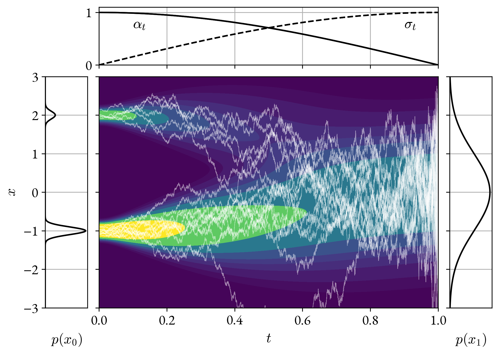
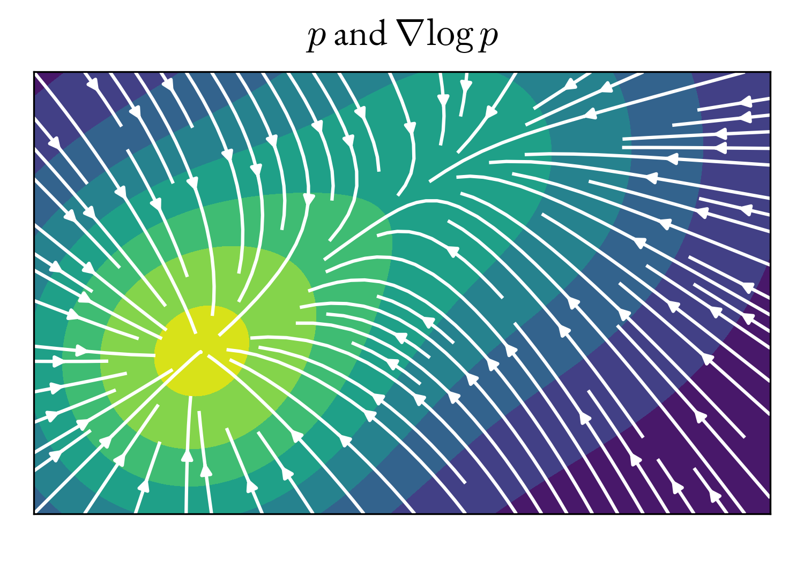
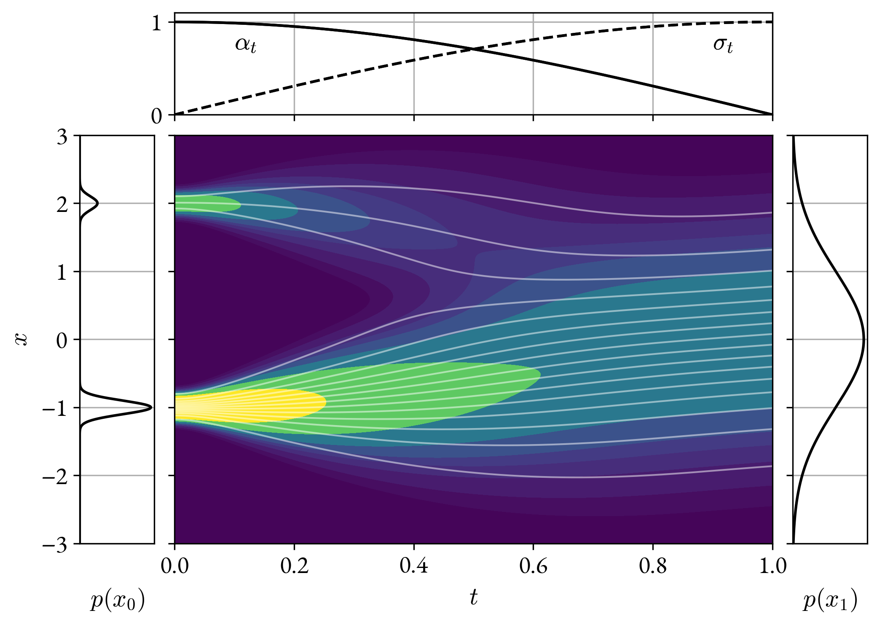

# Diffusion

## Forward process

The goal of generative modeling is to map a random variable with a known and
simple distribution (<i>e.g.</i> the normal distribution), to a random
variable distributed like the data:
\begin{equation}
    x \sim \normal{0}{I}\,; \quad y = f(x) \sim \mathrm{Data}\,.
\end{equation}

The function $$f$$ is to be learned from a sample from the data distribution.  At
this level it is not at all clear how a learning objective may be specifed for
$$f$$. One approach is learning to reverse a diffusion process in which small
amounts of noise are progressively added to the data variable $$y$$ until it
becomes essentially pure noise.

The diffusion process is described at a high level by the graphical model:

<figure>

</figure>

and in detail by the recurrence relation:
\begin{equation}
    x_{t + \Delta t} = \left(1 - \lambda_t \Delta t\right) x_t + g_t \sqrt{\Delta t}\, z_{t}\,,
\end{equation}
where:

1.  $$\{x_t\}$$ is a set of random variables, one for each value of $$t$$. The
    first one, $$x_0$$, is distributed like the data, and the following are
    progressively noisier.

1.  $$z_t \sim \normal{0}{I}$$ is the noise variable that is added at each step.
    $$z_t$$ is independent from $$z_s$$ for all $$t \neq s$$, and is also independent
    from $$x_s$$ for $$s \leq t$$.

1.  $$\lambda$$ and $$g$$ are function parameters that control the mixing of
    signal and noise at each step of the diffusion process.

1.  $$\Delta t$$ is a discretization step. In the limit $$\Delta t \to 0$$ the
    recurrence relation becomes a stochastic differential equation. Results
    below are given in this limit.

The recurrence relation is linear in the random variables $$x_{t}$$ and
$$z_{t}$$. Consequently, the joint distribution of any set of variables
$$(x_{t_1}, x_{t_2}, \ldots)$$ conditional on  $$x_0$$ is normal, and, in
particular:
\begin{equation}
     x_t|x_0 \sim \normal{\alpha_t x_0}{\sigma_t^2 I}\,,
\end{equation}
where the functions $$\alpha$$ and $$\sigma$$ uniquely determine the recurrence
relation parameters $$\lambda$$ and $$g$$:

$$
\begin{align}
&\lambda_t = -\frac{\dd}{\dd t}\log \alpha_t\,,\\
&g^2_t = \sigma^2_t \frac{\dd}{\dd t} \log \frac{\sigma^2_t}{\alpha^2_t}\,.
\end{align}
$$

Importantly, the recurrence relation can achieve *any* profile of $$\alpha$$
and $$\sigma$$, as long as as the signal-to-noise ratio $$\alpha / \sigma$$ is
monotonically decreasing (so that $$g^2$$ above is a positive number).

The explicit expression for the distribution of $$x_t|x_0$$ bypasses the
recurrence relation, and enables efficient sampling of $$x_t$$, both
conditionally on $$x_0$$ and unconditionally.

If, at some time $$T > 0$$, $$\alpha_T = 0$$ and $$\sigma_T=1$$, then $$x_T$$ follows
a standard normal distribution, and is the noise variable of known distribution
from which we want to learn to generate new samples of $$x_0$$.

Below is an illustrative one-dimensional example of the diffusion process. On
the left is the <q>data</q> distribution, which we take to be a mixture of two
narrow normal distributions. On the right is the final distribution
$$\normal{0}{I}$$. In the middle is a contour plot of the PDF of $$x_t$$, and
overlayed as white lines are 16 samples from the process.

<figure>

</figure>

## Reverse process

Remarkably, the joint distribution of $$x_t$$ specified by the diffusion process
can also be obtained in reverse, <i>i.e.</i> according to the graphical
model:
<figure>

</figure>
through the recurrence relation:
\begin{equation}
    x_{t - \Delta t} = \left(1 + \lambda_t \Delta t \right) x_t + g^2_t \Delta t \nabla \log p(x_t, t) + g_t \sqrt{\Delta t}\, \bar{z}_t
\end{equation}
where:

1.  \$$x_T \sim \normal{0}{I}$$

1.  $$\bar{z}_t \sim \normal{0}{I}$$. $$\bar{z}_t$$ is independent from
    $$\bar{z}_s$$ for all $$t \neq s$$, and also from $$x_s$$ for $$s \geq t$$.

1.  $$p(x,t)$$ is the marginal PDF of $$x_t$$, <i>i.e.</i>
    $$\mathrm{Pr}[x_t\in D] = \int_D p(x, t) \dd x$$ for any domain
    $$D$$. 

The joint distribution of $$x_t$$ generated by this recurrence relation is the
same as the one generated by the forward diffusion process. In particular,
$$x_0 \sim \mathrm{Data}$$, and the figure in the previous section is also an
entirely valid illustration of this reverse process.

The recurrence relation is not linear. This is necessary in order to generate a
non-normal distribution for $$x_0$$ from normally distributed $$x_T$$ and
$$\{z_t\}$$. Therefore, unlike the forward process, there is no way to sample
the process more efficiently than by using the recurrence relation.

<figure>

</figure>

The relation depends on the so-called <q>score function</q> $$\nabla \log p(x, t)$$.
This is a vector field that points everywhere towards regions of high
probability, and drives the reverse diffusion process there.  The practical use
of reverse diffusion to sample from the data distribution depends on the
ability to evaluate the score function efficiently.

## Denoising score matching

An efficient objective can be specified to learn a parametric approximation
$$s_\theta(x, t)$$ to the score function $$\nabla \log p(x, t)$$. The objective is
the naive one:
\begin{equation}
    L(\theta, t) = \expectation{x_t}{\left|s_{\theta}(x_t, t) - \nabla \log p(x_t, t)\right|^2}\,,
\end{equation}
but made tractable thanks to the non-trivial equivalence:
\begin{equation}
    L(\theta, t) = \expectation{x_0, x_t}{\left|s_{\theta}(x_t, t) - \nabla \log p(x_t | x_0, t)\right|^2}\,,
\end{equation}
where $$p(x_t|x_0, t)$$ is the PDF of $$x_t$$ *conditional* on $$x_0$$.

The second form is tractable because, as discussed before:
\begin{equation}
    x_t|x_0 \sim \normal{\alpha_t x_0}{\sigma_t^2 I}
\end{equation}
and hence:
\begin{equation}
    L(\theta, t) = \expectation{x_0, x_t}{\left|s_{\theta}(x_t, t) - 
    \frac{\alpha_tx_0 - x_t}{\sigma_t^2}\right|^2}\,.
\end{equation}

The learning objective can be interpreted as the objective for a denoising
autoencoder:

1.  Sample $$x_0$$ from the data distribution.

1.  Mix it with Gaussian noise $$z$$ to obtain $$x_t = \alpha_t\, x_0 +
    \sigma_t z$$.

1.  Regress the added noise $$z / \sigma_t$$ from the noisy
    variable $$x_t$$ to obtain $$s_\theta(x, t)$$.

## Probability flow

It is also possible to construct an ordinary differential equation that
reproduces the marginal distribution of $$x_t$$ according to the diffusion
process, but not the joint distribution of multiple variables $$(x_{t_0},
x_{t_1}, ...)$$:
\begin{equation}
    \frac{\dd x_t}{\dd t} = - \lambda_t x_t - \frac{1}{2}g^2_t \nabla \log p(x_t, t)\,.
\end{equation}

This ODE is known as the <q>probability flow</q> ODE, and it yields a
deterministic, invertible map between $$x_T \sim \normal{0}{I}$$ and $$x_0 \sim
\mathrm{Data}$$.  The trajectories generated by this ODE are illustrated in the
figure below:

<figure>

</figure>

## References

1.  <b>Anderson (1982), Reverse-time diffusion equation models.</b>
    First derivation of the stochastic differential equation that describes
    the reverse diffusion process.

1.  <b>Vincent (2011), A Connection Between Score Matching and
    Denoising Autoencoders.</b>

1.  <b>Sohl-Dickstein <i>et al.</i> (2015), Deep Unsupervised
    Learning using Nonequilibrium Thermodynamics</b>. First time learning to
    reverse the diffusion process. It does not use the language of SDEs and
    is not aware of the connection to score matching, but the substance is
    the same as what is described here.

1.  <b>Song, Ermon (2020), Generative Modeling by Estimating
    Gradients of the Data Distribution</b> First time the lanuage of SDEs is
    applied to the problem, and the connection to score matching is
    exploited. Interesting discussion on how the noise in score matching
    improves learning stability and the coverage of multiple distribution
    modes.

1.  <b>Ho <i>et al.</i> (2020), Denoising Diffusion Probabilistic
   Models</b>. Contemporanous to the previous paper, and makes roughly the
   same points.

1.  <b>Song <i>et al.</i> (2021), Score-Based Generative Modeling
   through Stochastic Differential Equations</b>. First time the probability
   flow ODE is introduced.

1. <b>Lipman <i>et al.</i> (2023), Flow Matching for Generative Modeling</b>.
   In this paper they arrive to the probability flow ODE through a fairly
   original path, but their method is entirely equivalent to chosing $$\alpha_t =
   1 - t$$ and $$\sigma_t = t$$. This choice differs from most of the literature,
   and they claim it yields better FID on ImageNet. Their training objective is
   also essentially equivalent to score matching, but they claim that their
   particular choice of $$\alpha$$ and $$\sigma$$ makes for an easier
   optimization.
