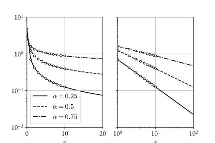
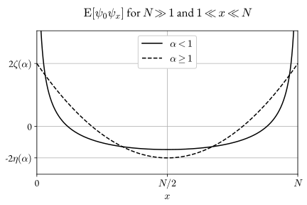

# Pink noise
<figure>
> x, 1' style='max-width:6in' />
</figure>
<figure>
> 1' style='max-width:6in' />
</figure>

Take $$N$$ real, <i>i.i.d</i> random variables $$(z_0, \ldots, z_{N - 1})$$,
with zero mean and unit variance:

\begin{equation}
\expectation{}{z_i} = 0\,,\quad \expectation{}{z_i z_j} = \delta_{ij}\,.
\end{equation}

Arrange them to form an $$N$$-dimensional _complex_ vector like so:

\begin{equation}
\phi = \frac{1}{\sqrt{2}}
\begin{pmatrix}1&\ii\end{pmatrix}
\begin{pmatrix}
\sqrt{2} z_0 & z_1 & z_3 & z_3 & z_1 \\
0 & z_2 & z_4 & -z_4 & - z_2
\end{pmatrix} \quad \text{$N = 5$ (odd)}
\end{equation}

\begin{equation}
\phi = \frac{1}{\sqrt{2}}
\begin{pmatrix}1&\ii\end{pmatrix}
\begin{pmatrix}
\sqrt{2} z_0 & z_1 & z_3 & \sqrt{2} z_5 & z_3 & z_1 \\
0 & z_2 & z_4 & 0 & -z_4 & - z_2
\end{pmatrix} \quad \text{$N = 6$ (even)}
\end{equation}

The vector $$\phi = (\phi_0, \ldots, \phi_{N-1})$$ has the properties:

\begin{equation}
\expectation{}{\phi_p} = 0\,,\quad
\expectation{}{\phi_p \overline{\phi}_q} = \delta_{pq}
\end{equation}

\begin{align}
&\overline{\phi}_0 = \phi_0 \\
&\overline{\phi}_p = \phi_{N - p}\quad \text{for $p > 0$}
\end{align}

Now we define the amplitude $$A_p$$ of each wave, which must satisfy
$$A_{N - p} = A_{p}$$ for $$p > 0$$. The noise amplitude is:

\begin{equation}
\psi_{x} = \sum_{p = 0}^{N - 1} \ee^{2\pi\ii\frac{px}{N}} A_{p} \phi_{p}\,,
\quad x\in\{0, \ldots, N-1\}\,.
\end{equation}

The noise is real, zero-mean and:

\begin{equation}
\expectation{}{\psi_x\psi_y} = \sum_{p =0}^{N - 1} \ee^{2\pi\ii\frac{p(x - y)}{N}} A^2_p\,.
\end{equation}

We want a power-law for low wave numbers, so one option is:

\begin{align}
&A_{0} = 0 \\
&A_{p} = \min{p}{N - p}^{-\alpha / 2} \quad \text{for $p > 0$}
\end{align}

A smoother option is:

\begin{align}
&A_{0} = 0 \\
&A_{p} = \left(\frac{N}{\pi} \sin \frac{\pi p}{N}\right)^{-\alpha / 2} \quad \text{for $p > 0$}
\end{align}

Both options are fine, they only differ in the UV behavior.

We want to characterize the function:
\begin{equation}
G_N(x, \alpha) \equiv \expectation{}{\psi_0\psi_x} = \sum_{p = 1}^{N - 1} \ee^{2\pi\ii\frac{px}{N}} \min{p}{N - p}^{-\alpha}\,.
\end{equation}

In particular we're interested in two limits: 

1. $$N \to \infty$$ at constant $$\hat x = x / N$$
2. $$N \to \infty$$ at constant $$x$$

In the first case we have:

\begin{equation}
\hat{G}_N(\hat{x}, \alpha) \equiv G_N(Nx, \alpha) = 
2\, \real{ \mathrm{Li}_{\alpha}\left(\ee^{2\pi\ii\hat{x}}\right)} + o(N^{0})
\end{equation}

and in particular:
\begin{equation}
\hat{G}_N(\hat{x}, 1) = - 2\, \log\left(2\sin \pi \hat{x}\right) + o(N^{0})
\end{equation}
