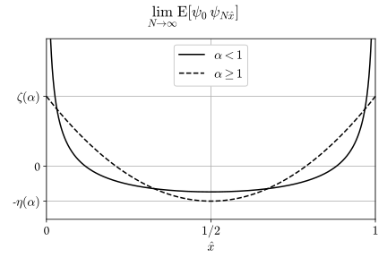
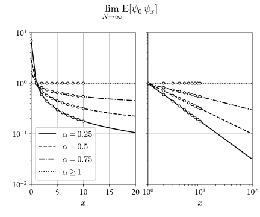

# Pink noise

According to Wikipedia, pink noise is

<q>a signal or process with a frequency spectrum such that the power spectral
density is inversely proportional to the frequency of the signal.</q>

At face value, this seems impossible. The integral of $$1 / \nu$$ does not
converge either at $$\nu = 0$$ or at $$\nu\to\infty$$, so a literal reading of
the definition requires the signal to carry infinte power both in the UV and
the IR.

The resolution, of course, is that the power law only holds for a range of
frequencies, and breaks down in the deep UV and the deep IR.

To understand a bit better how that happens, it's helpful to consider a
discrete, periodic stochastic signal $$\psi_x$$ with $$N$$ degrees of freedom
and power spectrum $$\nu^{-\alpha}$$, and its correlation function
$$E[\psi_0\psi_x]$$ in particular (see below for a precise definition).

There are two possible large-$$N$$ limits. The first is $$N \to \infty$$ at
fixed $$\hat{x} = x / N$$. In this limit, the correlation function exists for
all $$\alpha$$ and $$0 < \hat{x} < 1$$, but diverges at $$\hat{x} = 0$$ and
$$\hat{x} = 1$$ if $$\alpha < 1$$.

<figure>
> 1' style='max-width:6in' />
</figure>

The second limit is $$N \to \infty$$ at fixed $$x$$. In this case, the
correlation function has a non-trivial limit for $$0 < \alpha < 1$$, and is constant
for $$\alpha \geq 1$$.

<figure>
> x, 1' style='max-width:6in' />
</figure>

In particular, when both regimes apply, <i>i.e.</i> $$N \gg x \gg 1$$, the
correlation function is a constant for $$\alpha \geq 1$$, and follows a power
law if $$0 < \alpha < 1$$:
\begin{equation}
E[\psi_0\psi_x] \sim x^{\alpha - 1}\,.
\end{equation}

## Definition of the discrete stochastic signal

We define a periodic, real stochastic signal with $$N$$ degrees of freedom,
such that each of its Fourier components is an <i>i.i.d.</i> normal random
variable. To ensure that the signal is real, we construct the Fourier
transform as follows.

Let $$(z_i)_{i=0}^{N - 1}$$ be $$N$$ real, <i>i.i.d</i> random variables with
zero mean and unit variance:

\begin{equation}
\expectation{}{z_i} = 0\,,\quad \expectation{}{z_i z_j} = \delta_{ij}\,.
\end{equation}

We arrange them to form an $$N$$-dimensional _complex_ vector $$\phi$$ like so:

\begin{equation}
\phi = \frac{1}{\sqrt{2}}
\begin{pmatrix}1&\ii\end{pmatrix}
\begin{pmatrix}
\sqrt{2} z_0 & z_1 & z_3 & z_3 & z_1 \\
0 & z_2 & z_4 & -z_4 & - z_2
\end{pmatrix} \quad \text{$N = 5$ (odd)}
\end{equation}

\begin{equation}
\phi = \frac{1}{\sqrt{2}}
\begin{pmatrix}1&\ii\end{pmatrix}
\begin{pmatrix}
\sqrt{2} z_0 & z_1 & z_3 & \sqrt{2} z_5 & z_3 & z_1 \\
0 & z_2 & z_4 & 0 & -z_4 & - z_2
\end{pmatrix} \quad \text{$N = 6$ (even)}
\end{equation}

The vector $$\phi = (\phi_0, \ldots, \phi_{N-1})$$ has the following properties:

\begin{equation}
\expectation{}{\phi_p} = 0\,,\quad
\expectation{}{\phi_p \overline{\phi}_q} = \delta_{pq}
\end{equation}

\begin{equation}
\overline{\phi}_p = \left\{
\begin{split}
&\phi_0 \quad &&\text{if $p = 0$} \\
&\phi_{N - p}\quad &&\text{if $0 < p < N$}
\end{split}
\right.
\end{equation}

The signal $$\psi$$ is then defined as:

\begin{equation}
\psi_{x} = \sum_{p = 0}^{N - 1} \ee^{2\pi\ii\frac{px}{N}} A_{p} \phi_{p}\,,
\quad x\in\{0, \ldots, N-1\}\,,
\end{equation}

where the amplitude $$A_p$$ of each wave must satisfy $$A_{N - p} = A_{p}$$ for $$0 < p < N$$. 

The signal is real, zero-mean and:

\begin{equation}
\expectation{}{\psi_x\psi_y} = \sum_{p =0}^{N - 1} \ee^{2\pi\ii\frac{p(x - y)}{N}} A^2_p\,.
\end{equation}

We want the amplitudes to follow a power-law for $$1 \ll p \ll N$$. The
simplest choice is:

\begin{equation}
A_{p} = \left\{\begin{split}
&0 &&\text{if $p = 0$} \\
&\min{p}{N - p}^{-\alpha / 2}\quad  &&\text{if $0 < p < N$}
\end{split}\right.
\end{equation}

A smoother option is:

\begin{equation}
A_{p} = \left\{\begin{split}
&0 &&\text{if $p = 0$} \\
&\left(\frac{N}{\pi} \sin \frac{\pi p}{N}\right)^{-\alpha / 2}\quad  &&\text{if $0 < p < N$}
\end{split}\right.
\end{equation}

Both options are fine, they just yield slightly different behavior in the
small-$$x$$ regime.

## Asymptotics of the correlation function

We want to characterize large-$$N$$ limit of the function:
\begin{equation}
G_N(x, \alpha) \equiv \expectation{}{\psi_0\psi_x} = 
\frac{1}{2} \sum_{p = 1}^{N - 1} \ee^{2\pi\ii\frac{px}{N}} \min{p}{N - p}^{-\alpha}\,.
\end{equation}

We have:

\begin{equation}
\lim_{N\to\infty} G_N(N\hat{x}, \alpha) = \real{ \mathrm{Li}_{\alpha}\left(\ee^{2\pi\ii\hat{x}}\right)}\,,
\end{equation}

and in particular:

\begin{equation}
\lim_{N\to\infty} G_N(N\hat{x}, 1) = - \log\left(2\sin \pi \hat{x}\right)\,.
\end{equation}

For $$0 < \alpha < 1$$ we have
\begin{equation}
\lim_{N\to\infty} N^{\alpha - 1} G_N(x, \alpha) = \frac{1}{2} \int_0^{1} \ee^{2\pi\ii p x} \min{p}{1 - p}^{-\alpha}\dd p\,,
\end{equation}
wheras for $$\alpha > 1$$ we have:
\begin{equation}
\lim_{N\to\infty}  G_N(x, \alpha) = \zeta(\alpha)\,.
\end{equation}

These limits diverge for $$\alpha \to 1$$, but an additional
$$\alpha$$-dependent normalization factor can make the limit finite for all
$$\alpha$$, which is what is displayed in the plot at the top.

Finally, for $$0 < \alpha < 1$$ we have:
\begin{equation}
\lim_{x\to\infty}\lim_{N\to\infty} N^{\alpha - 1}  G_N(x, \alpha) =  \sin\frac{\pi \alpha}{2} \Gamma(1 - \alpha) (2\pi x)^{\alpha - 1}\,.
\end{equation}
