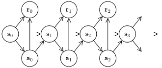

# Reinforcement learning

Reinforcement learning refers to a collection of thechniques for training
synthetic agents in situations where success can be defined easily, but it's
difficult to determine the optimal sequence of actions leading to it.

Examples of such problems are:

* Games like chess, go, Pac-Man etc...: it's easy to determine the winner,
  but difficult to prescribe the winning strategy.

* Legged robot locomotion: it's easy to determine if the robot is making
  progress, but difficult to prescribe the corresponding motion.

The interaction of the agent and its environment is modeled as a Markov decision
process. This is a probabilistic model described by the graphical model below,

<figure>

</figure>

where:

* $$\mathbf{s}_t$$ is a random variable representing the state of the
  environment at time $$t$$,

* $$\mathbf{a}_t$$ is a random variable representing the action performed by the
  agent at time $$t$$,

* the agent action $$\textbf{a}_t$$ at time $$t$$ depends on the state of the
  world $$\mathbf{s}_t$$,

* the state of the world $$\mathbf{s}_{t + 1}$$ depends on the previous state
  $$\mathbf{s}_t$$ and on the previous agent action $$\mathbf{a}_t$$.

The conditional distribution of the agent actions is called _policy_, and we
denote its PDF/PMF with: 

\begin{equation}
\pi(a | s, t) = \mathrm{Prob}\left[\mathbf{a}_t = a | \mathbf{s}_t = s \right]
\end{equation}

It is usually assumed that the policy does not depend on time: $$\pi(a |s, t) =
\pi(a | s)$$. While it is possible to include time in the state variable $$s$$,
that would imply that no state can be visited more than once, which would
preclude most estimation algorithm.

