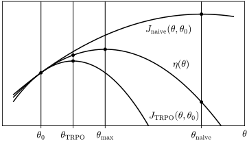

# Reinforcement learning

## Problem statement

Reinforcement learning refers to a collection of thechniques for training
synthetic agents in situations where success can be defined easily, but it's
difficult to determine the optimal sequence of actions leading to it.

Examples of such problems are:

* Games like chess, go, Pac-Man etc...: it's easy to determine the winner,
  but difficult to prescribe the winning strategy.

* Legged robot locomotion: it's easy to determine if the robot is making
  progress, but difficult to prescribe the corresponding motion.

The interaction of the agent and its environment is modeled as a Markov decision
process. This is a probabilistic model described by the graphical model below,

<figure>

</figure>

where:

* $$\mathbf{s}_t$$ is a random variable representing the state of the
  environment at time $$t$$.

* $$\mathbf{a}_t$$ is a random variable representing the action performed by the
  agent at time $$t$$.

* $$\mathbf{r}_t$$ is a random variable representing a reward that the agent
   receives upon taking an action.

* The agent action $$\textbf{a}_t$$ at time $$t$$ depends on the state of the
  world $$\mathbf{s}_t$$.

* The state of the world $$\mathbf{s}_{t + 1}$$ depends on the previous state
  $$\mathbf{s}_t$$ and on the previous agent action $$\mathbf{a}_t$$.

* In general, the reward $$\mathbf{r}_t$$ can be stochastic and depend on both
  the state $$\mathbf{s}_t$$ and the action $$\mathbf{a}_t$$. Most commonly, it
  is a deterministic function of the state alone.

* The conditional distributions $$(\mathbf{a}_t | \mathbf{s}_t)$$,
  $$(\mathbf{r}_t | \mathbf{s}_t, \mathbf{a}_t)$$, and
  $$(\mathbf{s}_{t + 1} | \mathbf{s}_t, \mathbf{a}_t)$$
  do not depend on time.

The conditional distribution of the agent actions given the state is called the
_policy_  and we denoted its PMF/PDF by:

\begin{equation}
\pi(a | s) = \mathrm{Prob}\left[\mathbf{a}_t = a | \mathbf{s}_t = s\right]\,.
\end{equation}

The goal of reinforcement learning is to obtain a policy that maximizes the
expected total discounted reward:

\begin{equation}
\eta(\pi) = \expectation{\pi}{\sum_{t = 0}^{\infty} \gamma^t \mathbf{r}_t}\,,
\end{equation}

where $$\gamma \in [0, 1)$$ is a discount factor that reduces the present value
of future rewards and the subscript $$\pi$$ indicates that the expectation
depends on the policy.

## Dynamic programming algorithms

If states and actions belong to a finite set, what is called a _finite_ Markov
decision process, a suite of efficient policy-optimization algorithms exists,
belonging to the general class of _dynamic programming_ algorithms.

### Value functions

Dynamic programming algorithms for reinforcement learning are based on _value
functions_, which summarize all the necessary information about future rewards
in a single value. These are the _state-value function_:

\begin{equation}
V_\pi(s) = \expectation{\pi}{\sum_{t = 0}^{\infty} \gamma^t
\mathbf{r}_t \Big| \mathbf{s}_0 = s}\,,
\end{equation}

and the _action-value function_:

\begin{equation}
Q_\pi(s, a) = \expectation{\pi}{\sum_{t = 0}^{\infty} \gamma^t
\mathbf{r}_t \Big| \mathbf{s}_0 = s,\, \mathbf{a}_0 = a}\,.
\end{equation}

The state-value function assigns to each state $$s$$ the expected total
discounted reward that can be obtained by starting from that state and following
policy $$\pi$$. The action-value assign to each pair $$(s, a)$$ the reward
that can be obtained by starting from $$s$$, taking action $$a$$ and then
following the policy $$\pi$$.

Dynamic programming algorithms require a complete tabulation of the state value
function, and are therefore limited in practice to problems with fewer than a
few billion states.

### Policy iteration

Given values for a policy $$\pi_0$$, an improved, _deterministic_ policy $$\pi_1$$
can be constructed by choosing in each state $$s$$ the action $$a$$ that
maximizes the action value of policy $$\pi_0$$:

\begin{equation}
\pi_1(a|s) = \delta_{a, \pi_1(s)}\quad \text{such that}\quad
Q_{\pi_0}(s, \pi_1(s)) = \mathrm{max}_{a}\left[Q_{\pi_0}(s, a)\right]\,.
\end{equation}

The policy $$\pi_1$$ constructed in this fashion constitutes an improvement over
$$\pi_0$$ in that it has value not less than $$\pi_0$$ in every state
([proof](#section-proofs-policy-iteration-inequality)):

\begin{equation}
V_{\pi_1}(s) \geq V_{\pi_0}(s)\quad \forall\, s\,,
\end{equation}

and consequently the expected total reward $$\eta(\pi_1)$$ is also not less than
$$\eta(\pi_0)$$.

Moreover, the inequality is strict for state $$s$$ if:

\begin{equation}
\mathrm{max}_a Q_{\pi_0}(s, a) > V_{\pi_0}(s)\,.
\end{equation}

Having obtained an improved policy $$\pi_1$$, the process can be repeated, using
the value functions of $$\pi_1$$ to obtain a further improved policy $$\pi_2$$.
The process terminates at policy $$\pi_\star$$ when no further improvement is
possible at any state, because

\begin{equation}
\mathrm{max}_a Q_{\pi_\star}(s, a) = V_{\pi_\star}(s)\,\quad \forall\, s\,.
\end{equation}

It is often claimed that the terminal policy is the optimal policy, i.e. that it
simultaneously maximizes the value at every state:

\begin{equation}
V_{\pi_\star}(s) = \mathrm{max}_{\pi} V_{\pi}(s)\,,
\end{equation}

however, I have not seen a convincing proof yet.

### Policy evaluation {#section-policy-evaluation}

The state-value function necessary for policy iteration can be computed
efficiently as the fixed point of the following recursion relation
([proof](#section-proofs-policy-evaluation)):

\begin{equation}
V_{\pi,\, k + 1}(s) = \expectation{\pi}{\mathbf{r}_0 +
\gamma V_{\pi,\, k}(\mathbf{s}_1)|\mathbf{s}_0 = s}\,,
\end{equation}

Then the action values can be computed as:

\begin{equation}
Q_\pi(s, a) =  \expectation{}
{\mathbf{r}_0 + \gamma V_\pi(\mathbf{s}_1)\big|\mathbf{s}_0 = s,\, \mathbf{a}_0 = a}\,,
\end{equation}

where the expectation does not depend on the policy because of the conditioning.

### Value iteration

It is not necessary to carry out the policy iteration algorithm explicitly.
Instead, the state value function of the terminal policy $$\pi_\star$$ can be
obtained as the fixed point of the recursion relation
([proof](#section-proofs-value-iteration-recursion-relation)):

\begin{equation}
V_{k + 1}(s) = \mathrm{max}_a\, \expectation{}
{\mathbf{r}_0 + \gamma\,
V_{k}(\mathbf{s}_1)\big|\mathbf{s}_0 = s,\, \mathbf{a}_0 = a}\,,
\end{equation}

where the expectation does not depend on the policy because of the conditioning.
The action-value function can be obtained from the state value as before, and
the terminal policy $$\pi_\star$$ is the one that choses the action with maximum
value at each state.

Alternatively, at the cost of tabulating one value for each state-action pair,
instead of just for each state, the action-value function of the terminal policy
can be obtained as the fixed point of the following recursion relation:

\begin{equation}
Q_{k + 1}(s, a) = \expectation{}
{\mathbf{r}_0 + \gamma\, \mathrm{max}_{a'}\, Q_{k}(\mathbf{s}_1, a')
\big|\mathbf{s}_0 = s,\, \mathbf{a}_0 = a}\,,
\end{equation}

where the expectation does not depend on the policy because of the conditioning.

## Policy gradient methods

Policy gradient methods assume that the policy is a differentiable function of a
collection of parameters $$\theta$$, estimate the gradient of the expected
reward with respect to these, and use stochastic gradient ascent to maximize
its value.

They are enabled by the following identity:

\begin{equation}
\nabla \eta(\pi) =
\expectation{\pi}{\sum_{t = 0}^{\infty}
A_\pi(\mathbf{s}_t, \mathbf{a}_t)
\nabla \log \pi(\mathbf{a}_t | \mathbf{s}_t)
}\,,
\end{equation}

where $$A_\pi$$ is the _advantage function_:

\begin{equation}
A_\pi(s, a) = Q_\pi(s, a) - V_\pi(s)\,.
\end{equation}

The term $$\nabla \log \pi$$ can be evaluated relatively cheaply using automatic
differentiation, but the advantage $$A$$ and the expectation also depend on the
policy, and they are very expensive to evaluate in practice, requiring a large
number of samples from the Markov decision process.  Therefore, it is tempting
to update them less frequently during optimization. That is, to keep a fixed
reference policy $$\pi_0$$ and run multiple optimization iterations on a loss
like:

\begin{equation}
L_{\mathrm{naive}}(\pi, \pi_0) =
\expectation{\pi_0}{\sum_{t = 0}^{\infty}
A_{\pi_0}(\mathbf{s}_t, \mathbf{a}_t) \log \pi(\mathbf{a}_t | \mathbf{s}_t)
}\,,
\end{equation}

or

\begin{equation}
L_{\mathrm{naive}}(\pi, \pi_0) =
\expectation{\pi_0}{\sum_{t = 0}^{\infty}
A_{\pi_0}(\mathbf{s}_t, \mathbf{a}_t) \frac{\pi(\mathbf{a}_t | \mathbf{s}_t)}
{\pi_0{(\mathbf{a}_t | \mathbf{s}_t)}}
}\,,
\end{equation}

both of which have the same gradient as $$\eta$$ at $$\pi_0$$:

\begin{equation}
\nabla_{\pi} L_{\mathrm{naive}}(\pi, \pi_0) |_{\pi = \pi_0} = \nabla \eta(\pi_0)
\end{equation}

<figure>

</figure>

## Proofs

### Bellman equation and policy evaluation {#section-proofs-policy-evaluation}

First we prove that the state value function satisfies the following functional
equation, a type of Bellman equation:

\begin{equation}
V_\pi(s) = \expectation{\pi}{\mathbf{r}_0 + \gamma V_\pi(\mathbf{s}_1)\big|\mathbf{s}_0 = s}\,.
\end{equation}

The proof works by separating the contribution from $$t = 0$$ and rewriting the
remainder again in terms of the value function:

\begin{split}
V_\pi(s) & =
\expectation{\pi}{\sum_{t = 0}^{\infty} \gamma^t\,\mathbf{r}_t \Big| \mathbf{s}_0 = s} \\
& = \expectation{\pi}{\mathbf{r}_0 \big|\mathbf{s}_0 = s} + \gamma\,
\expectation{\pi}{\sum_{t = 0}^{\infty} \gamma^t\,\mathbf{r}_{t + 1} \Big| \mathbf{s}_0 = s}\,.
\end{split}

Now we split the expectation as an outer expectation over variables
$$\mathbf{s}_0$$, $$\mathbf{a}_0$$ and $$\mathbf{s}_1$$, and an inner
expectation over variables $$\hat{\mathbf{s}}_1$$,
$$\hat{\mathbf{a}}_1,\,\hat{\mathbf{s}}_2,\,\ldots$$, which we mark with a hat
to avoid confusion with the outer variables:

\begin{equation}
V_\pi(s) =
\expectation{\pi}{\mathbf{r}_0 \big|\mathbf{s}_0 = s} +
\gamma\,
\expectation{\pi}{
\expectation{\pi}{\sum_{t = 0}^{\infty} \gamma^t\,\hat{\mathbf{r}}_{t + 1}
\Big| \hat{\mathbf{s}}_1 = \mathbf{s}_1}
\Big|\mathbf{s}_0 = s}\,.
\end{equation}

Now we use the fact that the conditional distributions do not depend on time to
shift the time index in the inner expectation:

\begin{equation}
V_\pi(s) = \expectation{\pi}{\mathbf{r}_0 \big|\mathbf{s}_0 = s} +
\gamma\,
\expectation{\pi}{
\expectation{\pi}{\sum_{t = 0}^{\infty} \gamma^t\,\hat{\mathbf{r}}_{t}
\Big| \hat{\mathbf{s}}_0 = \mathbf{s}_1}
\Big|\mathbf{s}_0 = s}\,.
\end{equation} 

Now we recongize the inner expecation as the value of state $$\mathbf{s}_1$$:

\begin{equation}
V_\pi(s) = \expectation{\pi}{\mathbf{r}_0 \big|\mathbf{s}_0 = s} +
\gamma\,
\expectation{\pi}{V_\pi(\mathbf{s}_1) \big|\mathbf{s}_0 = s}\,,
\end{equation} 

from which the Bellman equation follows.

The Bellman equation is the fixed point equation of the policy evaluation
recursion relation:

\begin{equation}
V_{\pi,\, k + 1}(s) = \expectation{\pi}{\mathbf{r}_0 +
\gamma V_{\pi,\, k}(\mathbf{s}_1)|\mathbf{s}_0 = s}\,.
\end{equation}

It is still necessary to show that the fixed point exists and is unique. This
is done by proving that the conditions for the Banach fixed point theorem are
met.

The action-value function also satisfies a similar Bellman equation:

\begin{equation}
Q_\pi(s, a) = \expectation{\pi}{\mathbf{r}_0 +
\gamma Q_\pi(\mathbf{s}_1, \mathbf{a}_1)\big|\mathbf{s}_0
= s, \mathbf{a}_0 = a}\,.
\end{equation}

The proof is analogous to the one for the state-value function.

### Policy iteration inequality {#section-proofs-policy-iteration-inequality}

First we observe that:

\begin{equation}
V_{\pi_0}(s) = \expectation{\pi_0}{
Q_{\pi_0}(\mathbf{s}_0, \mathbf{a}_0) \big | \mathbf{s}_0 = s}
\leq \mathrm{max}_a Q_{\pi_0}(s, a) = Q_{\pi_0}(s, \pi_1(s))\,.
\end{equation}

Then we express the action-value on the right hand side in terms of the state
value:

\begin{equation}
V_{\pi_0}(s) \leq \expectation{}
{\mathbf{r}_0 + \gamma V_{\pi_0}(\mathbf{s}_1)\big|\mathbf{s}_0 = s,\,
\mathbf{a}_0 = \pi_1(s)}\,.
\end{equation}

Then we observe that, because $$\pi_1$$ is deterministic, conditioning on
the action is the same as taking an expectation under $$\pi_1$$:

\begin{equation}
V_{\pi_0}(s) \leq
\expectation{\pi_1}
{\mathbf{r}_0 + \gamma V_{\pi_0}(\mathbf{s}_1)\big|\mathbf{s}_0 = s}\,.
\end{equation}

Now we apply this inequality again to the value inside the expectation:

\begin{equation}
V_{\pi_0}(s) \leq
\expectation{\pi_1}
{\mathbf{r}_0 + \gamma \left(
\expectation{\pi_1}
{\hat{\mathbf{r}}_0 + \gamma V_{\pi_0}(\hat{\mathbf{s}}_1)\big
|\hat{\mathbf{s}}_0 = \mathbf{s}_1}
\right)
\big|\mathbf{s}_0
= s}\,,
\end{equation}

where we have marked with a hat the random variables of the inner expectation,
to avoid confusing them with those of the outer expectation.

Now we use the fact that conditional probabilities do not depend on time to
shift the time index in the inner expectation:

\begin{equation}
V_{\pi_0}(s) \leq
\expectation{\pi_1}
{\mathbf{r}_0 + \gamma \left(
\expectation{\pi_1}
{\hat{\mathbf{r}}_1 + \gamma V_{\pi_0}(\hat{\mathbf{s}}_2)\big
|\hat{\mathbf{s}}_1 = \mathbf{s}_1}
\right)
\big|\mathbf{s}_0
= s}\,,
\end{equation}

Now the variables of the inner expectation have the same joint distribution as
those of the outer expectation, and the right hand side can be written as a
single expectation:

\begin{equation}
V_{\pi_0}(s) \leq
\expectation{\pi_1}
{\mathbf{r}_0 + \gamma \left(
\mathbf{r}_1 + \gamma V_{\pi_0}(\mathbf{s}_2)
\right)
\big|\mathbf{s}_0
= s}\,.
\end{equation}

The procedure can be repeated, to yield:

\begin{equation}
V_{\pi_0}(s) \leq
\expectation{\pi_1}
{\mathbf{r}_0 + \gamma \left(
\mathbf{r}_1 + \gamma \left(\mathbf{r}_2 + \gamma \left(\ldots\right)\right)
\right)
\big|\mathbf{s}_0
= s} = V_{\pi_1}(s)\,.
\end{equation}

If the initial inequality is strict, this final inequality is also strict.

### Value iteration recursion relation {#section-proofs-value-iteration-recursion-relation}

The terminal policy $$\pi_\star$$ satisfies

\begin{equation}
V_{\pi_\star}(s) = \mathrm{max}_a Q_{\pi_\star}(s, a) \,\quad \forall\, s\,.
\end{equation}

We rewrite the right hand side in terms of the state value:

\begin{equation}
V_{\pi_\star}(s) = \mathrm{max}_a\, \expectation{}
{\mathbf{r}_0 + \gamma\, V_{\pi_\star}(\mathbf{s}_1) \big|
\mathbf{s}_0 = s,\, \mathbf{a}_0 = a}\,,
\end{equation}

which is the fixed point equation of the value iteration recursion relation:

\begin{equation}
V_{k + 1}(s) = \mathrm{max}_a\, \expectation{}
{\mathbf{r}_0 + \gamma\,
V_{k}(\mathbf{s}_1)\big|\mathbf{s}_0 = s, \mathbf{a}_0 = a}\,.
\end{equation}

It is still necessary to show that the fixed point exists and is unique.

The action-value recursion relation is proved in a similar way.
