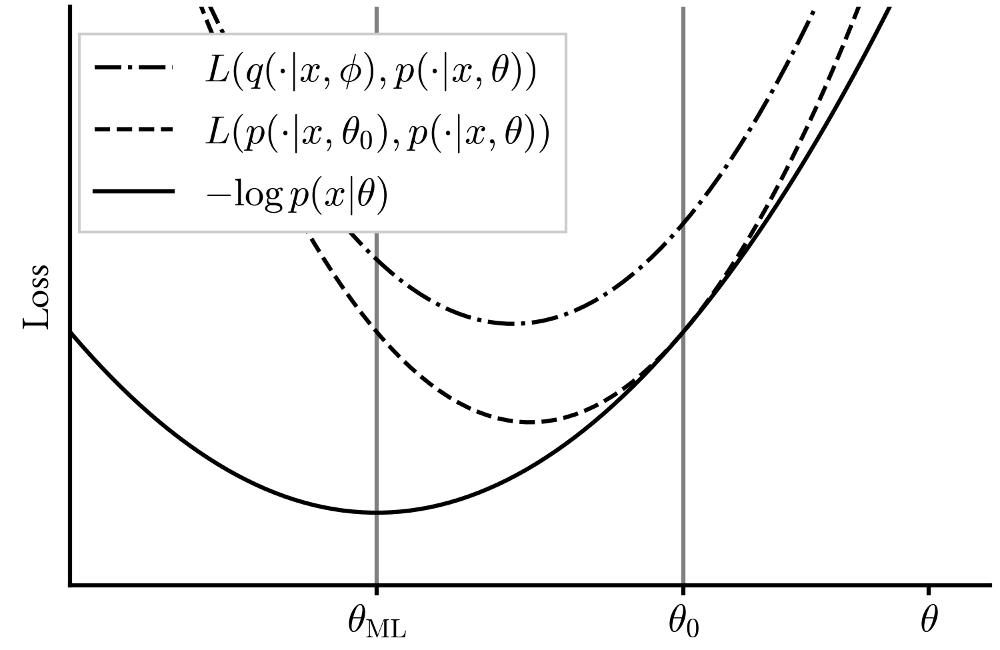

# Auto-encoding variational Bayes

## Model

We describe a technique for carrying out inference on directed probabilistic
models with continuous latent variables, as introduced in [[1]][ref_1]. That
is, the model is defined by a joint probability distribution $$p$$,
parametrized by $$\theta$$, over observed variables $$x$$ and unobserved,
continuous variables $$z$$. The model is directed, meaning that both the latent
prior $$p(z|\theta)$$ and the latent-conditional likelihood $$p(x | z,
\theta)$$ can be efficiently evaluated, as well as sampled from.

For concreteness, [[1]][ref_1] presents an example where the observed variables
$$x \in \{0, 1\}^M$$ are the pixel values of a MNIST image. $$M = 28 \times
28$$ is the number of pixels in the image. The latent variables $$z \in
\mathbb{R}^D$$ encode, among other things, the corresponding digit. The latent
prior is the standard normal: $$z \sim \normal{0}{I}$$, and the
latent-conditional likelihood is a product of Bernoulli distributions:

\begin{equation}
p(x|z) = \prod_{a = 1}^{M} \left[\pi_a(z, \theta)\right]^{x_a}
\left[1 - \pi_a(z, \theta)\right]^{1 - x_a}\,.
\end{equation}

The vector of Bernoulli parameters $$\pi(z, \theta) \in [0, 1]^M$$ is specified
by a multi-layer perceptron with inputs $$z$$ and parameters $$\theta$$.

## Motivation

Given an i.i.d. sample $$\{x_i\}_{i = 1}^{N}$$ of the observed variable, the
technique yields an approximation to the maximum likelihood parameters
$$\theta_{\star}$$, as well as an approximation to the latent posterior $$p(z |
x, \theta_\star)$$ that can be efficiently evaluated and sampled from.

There are two main motivations to consider this type of model and inference:

1. Generative modeling. Given an approximation to $$\theta_\star$$, more
samples of $$(x, z)$$ can be generated efficiently according to the model.
These samples will be similar to those drawn from the empirical distribution of
$$x$$, to the extent that it can be correctly captured by the model.

2. Representation learning. The latent posterior $$p(z | x, \theta_\star)$$
associates a distribution in latent space to each value of $$x$$. This
distribution, and its mean in particular, retains information about $$x$$ in a
compressed form that is tuned to the empirical distribution of $$x$$. From this
point of view, the approximate latent posterior can be seen as an *encoder*,
and the latent-conditional likelihood as a *decoder*.

## Variational bayes

Naive maximum likelihood inference on this type of models is difficult, because
the latent-marginal likelihood

\begin{equation}
p(x|\theta) = \int \dd z\ p(x, z|\theta)
\end{equation}

is not tractable. Given any set of parameters $$\theta$$, it is possible to
efficiently *sample* $$x$$ according to the model, but it is not possible to
efficiently _evaluate_ $$p(x|\theta)$$ at a given value $$x = x_i$$ drawn from
the empirical distribution. The integral domain is high-dimensional, and the
integrand is a complicated, strongly-peaked function.

Variational bayesian inference works around this obstruction by constructing a
parametric approximation to the latent posterior:
\begin{equation}
q(z|x, \phi) \simeq \frac{p(x, z | \theta)}{p(x|\theta)}\,.
\end{equation}

Unlike the true posterior, the approximation $$q$$ can be designed for
efficient evaluation and sampling. The approximation parameters $$\phi$$ depend
on $$\theta$$, and they are obtained by optimizing an objective that we are
about to describe.

For concreteness, in the MNIST example, the approximate posterior chosen in
[[1]][ref_1] is a normal distribution, whose mean and standard deviation are
generated by a multi-layer perceptron with input $$x$$ and parameters $$\phi$$:
\begin{equation}
q(z|x, \phi) = \normalpdf{z}{\mu(x, \phi)}{ \sigma^2(x, \phi) I}\,.
\end{equation}

A natural choice for the optimization objective is the KL divergence between
the approximate and true posterior. Of the two possible choices of divergence,
only one leads to a tractable objective, thanks to the fact that, by
assumption, we can efficiently evaluate and sample from $$q$$:
\begin{equation}
\kldiv{q(\cdot|x,\phi)}{p(\cdot |x, \theta)} = \int \dd z\, q(z|x, \phi)\
\log \frac{q(z|x, \phi) p(x|\theta)}{p(x, z| \theta)}\,.
\end{equation}

The KL divergence still depends on the intractable latent-marginal likelihood
$$p(x|\theta)$$, but only through a constant that does not depend on $$q$$.
Therefore, the following minimzation objective is both tractable, and entirely
equivalent to the KL divergence for the purpose of obtaining the approximate
posterior $$q$$:
\begin{equation}
L\left(q(\cdot|x, \phi), p(x, \cdot| \theta)\right) \equiv \int \dd z\, q(z|x, \phi)\
\log \frac{q(z|x, \phi)} {p(x, z| \theta)}\,.
\end{equation}

Remarkably, the function $$L$$ also serves as minimization objective to obtain
an approximation to the maximum likelihood value of $$\theta$$. This is because
$$L$$ is an upper bound on the negative log likelihood:
\begin{equation}
L\left(q(\cdot|x, \phi), p(x, \cdot| \theta)\right) =
\kldiv{q(\cdot|x,\phi)}{p(\cdot |x, \theta)} - \log p(x|\theta)
\geq - \log p(x|\theta)\,.
\end{equation}

For any given $$\theta = \theta_0$$, the bound is saturated when $$q$$ is equal
to the true latent posterior. In this case the gradient of $$L$$ with respect
to $$\theta$$, taken with constant $$q$$, also matches the gradient of the
negative log likelihood:

\begin{equation}
\left.\nabla_\theta L\left(p(\cdot|x, \theta_0), p(x, \cdot| \theta)\right)
\right|_{\theta = \theta_0} =
- \left.\nabla_\theta \log p(x|\theta) \right|_{\theta=\theta_0}\,.
\end{equation}

The properties of the objective $$L$$ as a function of $$\theta$$ are
illustrated by the figure below. For any approximate posterior $$q$$, $$L$$ is
greater than the NLL. If $$q$$ is the true latent posterior $$p(z|x,
\theta_0)$$ for some fixed $$\theta_0$$, then $$L$$ is both equal to, and
tangent to the NLL at $$\theta_0$$.

<figure>

</figure>

Therefore, inference can be carried out by maximixing the objective with
respect to $$\phi$$ and $$\theta$$ simultaneously. Within an iterative scheme,
the optimization with respect to $$\phi$$ keeps $$q$$ close to the true latent
posterior for the current value of $$\theta$$. Consequently the objective, as a
function of $$\theta$$ is a good local approximation to the NLL, and the
optmization with respect to $$\theta$$ brings it closer to the maximum
likelihood value. If the true latent posterior can be represented exactly by
the parametric form of $$q$$, then the global minimum of the objective is
$$\theta = \theta_{\mathrm{ML}}$$ and $$q$$ equal to the true latent posterior
at $$\theta = \theta_{\mathrm{ML}}$$.

It is often beneficial to express the objective in terms of the latent prior
$$p(z|\theta)$$ and latent-conditional likelihood $$p(x|z, \theta)$$:

\begin{equation}
L\left(q(\cdot|x, \phi), p(x, \cdot| \theta)\right) = \kldiv{q(\cdot|x,\phi)}{p(\cdot|\theta)}
- \expectation{z}{\log p(x|z, \theta)}\,.
\end{equation}

The KL divergence can often be computed analytically, bypassing the need to
sample according to the approximate posterior, and thus reducing the variance
of $$L$$. For example this is the case in the MNIST model where both the latent
prior and the approcimate posterior are Normal distributions.

## The reparametrization trick

The objective $$L$$ requires an integral over the latent variables, which in
practice must be estimated by sampling $$z$$ according to the approximate
posterior $$q$$:

\begin{equation}
L\left(q(\cdot|x, \phi), p(x, \cdot| \theta)\right) =\expectation{z}{
\log \frac{q(z|x, \phi)} {p(x, z| \theta)}}\,.
\end{equation}

However, the gradient with respect to $$\phi$$ is a bit problematic, because it
affects the measure of the expectation as well as the argument. The naive
solution is to exploit the identity:

\begin{equation}
\nabla_\phi \expectation{z}{f(z)} =
\expectation{z}{f(z) \nabla_\phi \log q(z| x, \phi)}\,,
\end{equation}

but this estimator of the gradient has usually very high variance [[2]][ref_2],
and is therefore impractical.

An estimator with lower variance can be obtained if we assume that $$z | x,
\phi$$ is obtained by applying a parametric function $$g$$ to a standard normal
random variable $$\epsilon$$:
\begin{equation}
z | x, \phi = g(\epsilon, x, \phi)\quad \epsilon \sim \normal{0}{I}\,.
\end{equation}

For example, this is the case in the MLP-parametrized posterior of the MNIST
example:
\begin{equation}
z = \mu(x, \phi) + \sigma(x, \phi) \epsilon\,.
\end{equation}

With this assumption, the expectation over $$z$$ can be replaced by the
expectation over $$\epsilon$$:
\begin{equation}
\expectation{z}{f(z)} = \expectation{\epsilon}{f(g(\epsilon, x, \phi))}\,,
\end{equation}
which in the case of the objective function $$L$$ yields:
\begin{equation}
L\left(q(\cdot|x, \phi), p(x, \cdot| \theta)\right) =\expectation{\epsilon}{
\log \frac{q(g(\epsilon, x \phi)|x, \phi)} {p(x, g(\epsilon, x, \phi)| \theta)}}\,.
\end{equation}

Now the expectation measure does not depend on $$\phi$$, so the gradient can be
computed naively, and the resulting estimator has lower variance.

If helpful to produce the correct distribution of $$z$$ according to the
approximate posterior, distributions other than the standard normal may be
also be chosen for $$\epsilon$$.



